# gudumpinfo — Graphic UEFI System Info Viewer

> [English version below](#english) ｜ [English README](#english)

gudumpinfo 是一个运行在 **UEFI Shell** 中的图形化系统信息查看器，定位类似 Windows 下的系统信息工具，但运行在固件环境里——不依赖任何操作系统。它基于 LVGL 图形库构建，**全简体中文界面**（内置中文字库），鼠标与键盘双输入，覆盖 UEFI 开发者日常排障所需的全部底层信息：Handle/Protocol、设备、驱动、映射、内存映射、GCD、PCI 树、USB 树、SMBIOS、变量、HOB、ACPI 表，以及深度解析的 **CPUID**。**支持 X64 与 AArch64 双架构**（一套源码；AArch64 上 x86 专属视图 CPUID/IO 端口/MSR 自动灰调，其余一致可用，见「构建」节）。

> 在固件世界，想看一眼 CPU 到底是什么、ACPI 表里写了什么，不该只能敲命令。

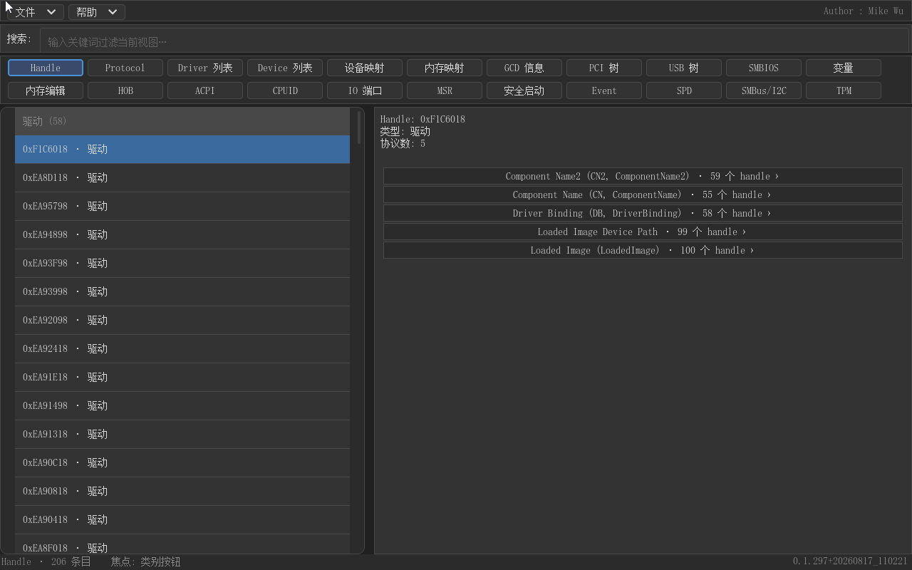

- **作者**：Mike Wu
- **许可证**：MIT
- **图形库**：[LVGL 9.2.2](https://lvgl.io)（独立开源，见下方依赖）
- **界面语言**：简体中文（SimSun 中文字体内置）
- **产品手册**：[功能演示 GIF](docs/manual/gudumpinfo-overview.gif) ｜ [说明书（简版）](docs/manual/gudumpinfo-说明书-简版.md) ｜ [说明书（详版）](docs/manual/gudumpinfo-说明书-详版.md)

---

## 目录

- [功能特性](#功能特性)
- [界面一览](#界面一览)
- [产品手册](#产品手册)
- [依赖](#依赖)
- [目录结构](#目录结构)
- [构建](#构建)
- [运行](#运行)
- [验证与取证](#验证与取证)
- [截图展示](#截图展示)
- [已知限制](#已知限制)
- [许可证](#许可证)

## 功能特性

- **19 个信息视图 + 5 个开发中占位**（主界面按钮导航，按钮栏 12 列，两行 24 个按钮排布；SPD/SMBus-I2C/TPM/Dependency/EC 为即将推出的功能占位，点击提示"开发中"；Event/Timer 紧随协议中心之后）：
  - **Handle/Protocol**：handle → 挂载的 protocol（**590+ 条可读名表**：edk2 全包 + gEdkii + MTL 平台协议，附**常用缩写别名**如 Graphics Output (GOP)；协议行显示**安装计数**「· N 个 handle」，点击反向查询）→ DevicePath
  - **协议（M16）**：系统**全部已安装协议**中心——左协议清单（名字 + 别名 + 安装数，可搜索）→ 右安装它的 handle 列表 → 点击跳回 Handle 视图定位；支持 .gud 保存/载入
  - **设备列表 / 驱动列表 / 设备映射**：设备路径、**设备实例名**（ComponentName2 尽力而为，如 "QEMU Video PCI Adapter"）、驱动绑定关系、fs0:/blk0: 映射与卷标
  - **内存映射**：GetMemoryMap 描述符，按类型分类/平铺两种视图
  - **GCD**：内存空间 + IO 空间双表，按分类/平铺 + 子页签
  - **PCI 树 / USB 树**：全扫描设备树，配置空间十六进制查看，Enter 跳转对应 Handle
  - **SMBIOS**：Type 0/1/2/3/4… 逐字段中文解读
  - **变量**：GetNextVariableName 枚举，按属性（NV/RT/volatile）分组
  - **内存编辑 / HOB**：十六进制编辑器（UEFI 内存直读直写），HOB 列表 + 编辑
  - **ACPI**：全部 ACPI 表按分类列出，普通表逐字段解析（FADT/MADT/FACS…），**AML 表（DSDT/SSDT）反编译成 ASL**，ASL↔HEX 双向联动（点 ASL 行高亮对应字节区间），HEX 可编辑、**校验和自动重算**
  - **CPUID**：全量 leaf 采集（标准 0x00-0x2F + 扩展 0x80000000-0x26），**表格化逐位域解析**——每行 `位域 | Bits | 值 | 结论 | 说明`，1-bit 特性位显示明确的 **支持/不支持** 结论防误读；**说明列括注当前值**（枚举中文名/十进制，如 `（当前: 8）`，M16）；41 个 leaf 定义、2470 个位域、577 条中文解释（含 Key Locker/PCONFIG/LBR/AMX/TMUL/SGX/ArchPerfmon 及 AMD Zen4/Zen5 全系，均自 Intel SDM / AMD APM 查证）；**平台识别**（Meteor Lake/Arrow Lake/Panther Lake 等型号表自官方 EDS）；清单三组（标准/扩展/**未定义**）可折叠
  - **IO 端口**：x86 IO 空间（0x0000-0xFFFF）**Byte/Word/DWord 三种宽度读写**——窗口式浏览（256 端口/窗，翻窗不自动读）、内置**常用端口注解表**（约 60 端口：DMA/PIC/PIT/键盘/CMOS/POST/串并口/ATA/VGA/PCI 配置等，危险端口红/橙标记）；**强写保护**：进入零读取、一切访问显式触发；写操作三级管控——普通端口一次确认、**危险端口**（PIC/PIT/DMA/CMOS/PCI 配置 0xCF8/0xCFC 等）**二次确认**、**致命端口**（复位 0xCF9/0x92、CMOS 索引 0x70、键盘命令 0x64、SuperIO 索引）**直接拒绝**；宽度对齐硬规则（奇数端口仅 Byte）；副作用读端口（0x60/0x64）警告条提示；PCI 配置空间读取（0xCF8 写地址 + 0xCFC 读数据）
  - **MSR**：x86 模型特定寄存器**读写**——左侧分组 MSR 清单（**1359 条自动生成知识表**：MdePkg 架构 MSR 358 + MTL 平台特有 1001，含地址/名称/位域/只读标志，按组折叠），右侧 **64 位值 + 逐位域解析表**（位范围/字段名/值/说明），**MTRR 专门解析**（PHYSBASE/PHYSMASK 配对算内存区间：从哪到哪、大小、UC/WC/WT/WP/WB 类型；固定范围段摘要；DEF_TYPE 默认类型 + FE/E 启用位）；顶部 CPU 摘要条（型号/微码/缓存/核心线程/频率/温度）；**核选择 + 全核批量读**（MP Services 逐核执行）；**写入三级保护**（致命置灰/危险二次确认/普通一次确认，默认禁写需 ⚙ 设置开启）；**危险读拦截**（APIC/X2APIC 读取会死机的寄存器红字警示且不执行读取）；可选 **#GP 安全读钩子**（EFI_CPU_ARCH_PROTOCOL，默认关）
  - **Event/Timer（新增）**：**全系统事件与定时器扫描**——内存扫描 EDK2 `IEVENT` 事件对象（'evnt' 签名 + 多层结构校验 + 自校准验证固件兼容性），左侧分组列表 **Event**（组事件/协议通知事件，组头显示计数可折叠）/ **Timer**（周期定时器，显示周期估算与挂载状态），右侧逐字段详情（事件类型位解读、通知级别、通知函数地址与**所属模块名**（OVMF GUID 映射表 / 真机 DEBUG BIOS 的 PDB 反查，回退 DevicePath）、事件组 GUID、触发计数、ExFlag、Timer 周期/下次触发）；协议通知事件解析**挂载协议名**（如 Loaded Image）；详情下方**「查看句柄」链接一键跳转 Handle 视图**；全局搜索**大小写不敏感模糊匹配**（搜 "exit" 命中 ExitBootServices 组事件，也可按协议名/模块名/通知级别过滤）；.gud 保存/载入（168 字节定长条目）
  - **Secure Boot**：安全启动状态与证书库**只读**查看——顶部**摘要条**（Secure Boot 启用/禁用徽标 + **派生模式**：设置/用户/部署/审计（SetupMode/DeployedMode/AuditMode 规范状态机推导）+ 签名类型数 + 认证变量数，第二行各库 `类型:数量` 一览，点击"签名类型:N"弹详情）；左列表**六个标准签名库**（PK/KEK/db/dbx/dbt/dbr）+ Default 系列（PKDefault/KEKDefault/dbDefault/dbxDefault）+ **全部认证变量**（EFI_VARIABLE_AUTHENTICATED_ACCESS_ACCESS 属性的第三方变量，如 shim 的 MokList，按名称排序、上限 64）；右表格条目列（序号/签名类型/主题 CN 或哈希摘要/大小），选中条目**X509 证书详细解析**（手写轻量 DER：subject/issuer 的 CN/O/C/OU、序列号、有效期、公钥算法与位数、**SHA256 指纹**），SHA256 哈希类签名显示完整 32 字节；库缺失显示"（不存在）"灰字、签名列表越界显示"（解析失败）"红字且不影响其他库；Tab 左库/右条目双焦点区、Ctrl+F 搜索库名；数据源全部为 UEFI 变量（SecureBoot/SetupMode/PK/KEK/db/dbx 等），不含 enroll/写入操作
  - **Save As / Load From File（M15）**：文件菜单"**保存当前视图为文件…**"（Ctrl+S）/ "**从文件载入…**"（Ctrl+L）——把任意视图采集的原始数据保存为 `.gud` 文件（弹窗选卷 + 推荐文件名 `gud_<功能>_<时间戳>.gud`），可在另一台机器/QEMU 上**数据级回放**（ACPI 载入后可重新反编译、内存编辑载入后可查看编辑，状态栏标记"已载入"）；文件头含 `GUDINFO` 大签名 + 功能小签名 + 双字节和校验，损坏/截断文件容错解析（非法记录跳过，部分可用也载入）；**16 个视图**（除 IO 端口）全部支持，载入自动路由到对应视图，Ctrl+R 恢复实时数据——真机故障现场可 Save 下来在 QEMU 上复现调试
- **搜索**：全局搜索框，**大小写不敏感**匹配标题、协议名与**别名**（搜 "GOP" 命中 Graphics Output）、十六进制 leaf 号、位域名与中文解释
- **键盘焦点**：Windows 风格 Tab 区域切换，焦点高亮/失焦低亮；Esc 三级处理、Ctrl+R 刷新
- **自绘表格组件**：虚拟滚动（仿 CodeView），千行级数据无内存压力

## 界面一览

主界面自上而下：菜单栏（文件：刷新/保存/载入/退出；帮助：关于）→ 搜索框 → 两行 11 列 22 个功能按钮 → 内容区（左侧清单 + 右侧详情，或自定义内容）→ 状态栏（`视图 · N 条目`）。

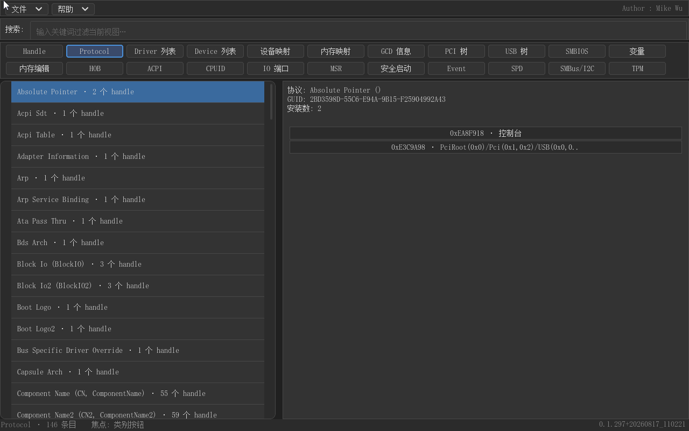

协议中心（M16）：左侧全部已安装协议清单（名字 + 别名 + 安装数，可搜索），右侧安装该协议的 handle 列表——协议 → handle 的反向查询入口。

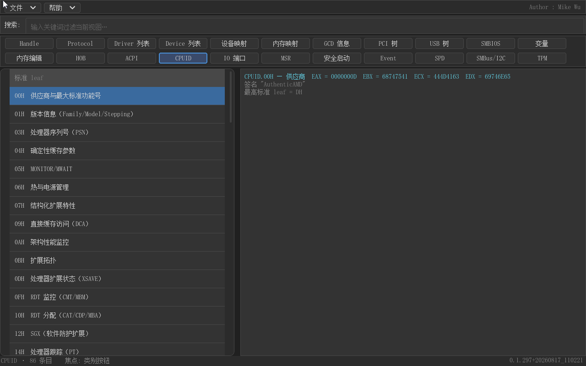

CPUID 视图：左侧 leaf 清单（三组折叠），右侧五列表格逐位域解析，带支持/不支持结论、平台识别与**位域当前值括注**（如 `（当前: 8）`）。


MSR 视图：顶部 CPU 摘要条（型号/微码/缓存/核线程/频率/温度 + 核选择）+ 左侧分组 MSR 清单（危险读条目红色 ⚠ 警示）+ 右侧 64 位值、逐位域解析表与 MTRR 区间解析行。

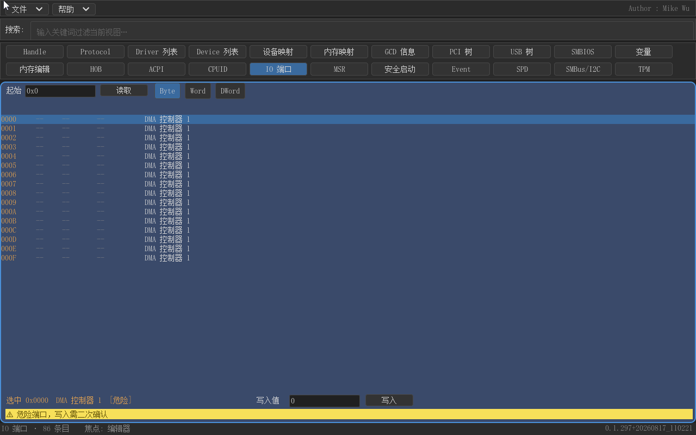

IO 端口视图：控制条（起始地址 + 读取 + 宽度 TabBar）+ 端口值表（地址/Byte/Word/DWord/注解，虚拟滚动）+ 选中端口操作条（写入值 + 写入按钮）+ 双警告条（读取范围/副作用端口、危险端口提示）。写操作三级管控：普通一次确认、危险端口二次确认、致命端口直接拒绝。


Secure Boot 视图：顶部摘要条（启用徽标 + 派生模式:用户 + 签名类型数 + 认证变量数）+ 左侧签名库列表（PK/KEK/db/dbx 有内容，缺失库灰字"（不存在）"）+ 右侧条目列表（序号/类型/主题 CN/大小），选中 X509 条目可看完整证书解析（CN/序列号/有效期/公钥/SHA256 指纹）。

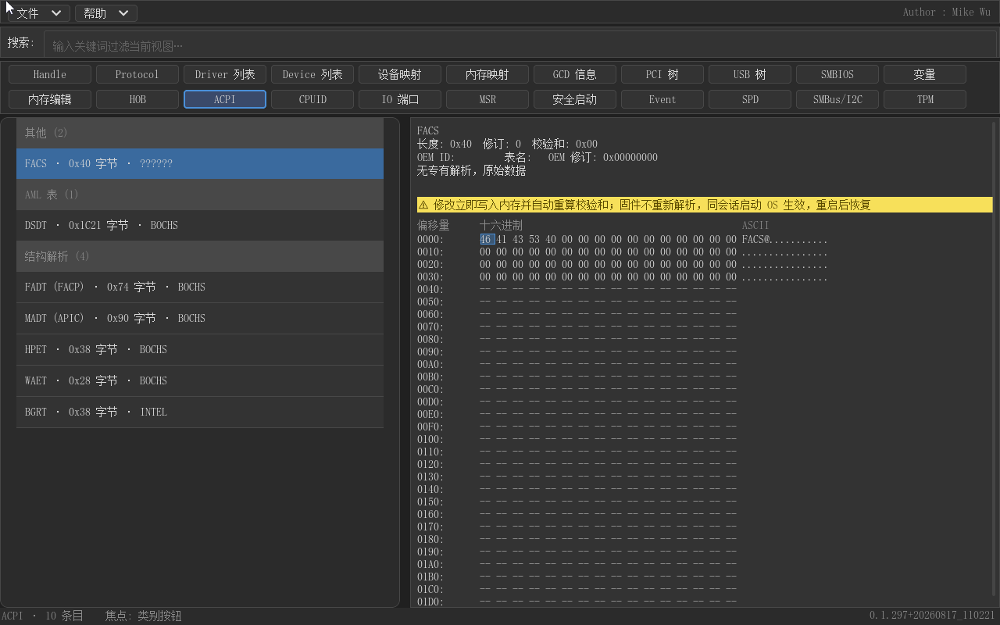

ACPI 视图：全部 ACPI 表按分类列出，普通表逐字段解析（FADT/MADT/FACS…），AML 表（DSDT/SSDT）反编译成 ASL，ASL↔HEX 双向联动，HEX 可编辑、校验和自动重算。

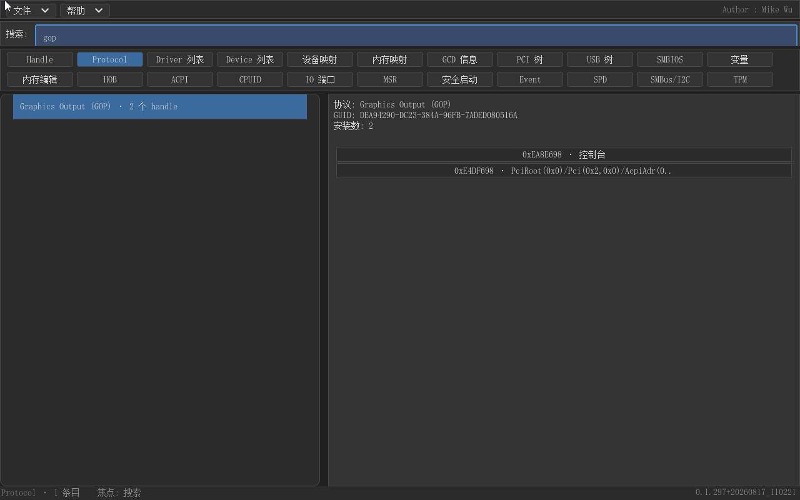

搜索框大小写不敏感过滤当前视图，支持协议别名（搜 "GOP" 命中 Graphics Output）。

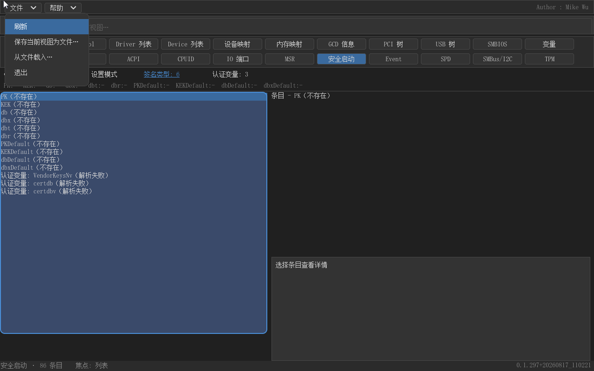

文件菜单：刷新 / 保存当前视图为文件…（Ctrl+S）/ 从文件载入…（Ctrl+L）/ 退出。


保存对话框（M15）：目标卷下拉 + 推荐文件名（`gud_<功能>_<时间戳>.gud`）+ 保存/取消；标题显示当前视图名，保存对象一目了然。

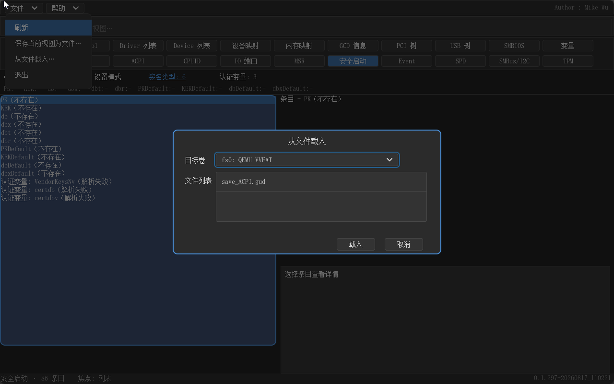

载入对话框：目标卷 + `.gud` 文件列表（Up/Down 键盘选择）；选中后先解析文件头，确认框显示"该文件是 X 视图数据（N 条目），载入并切换到 X 视图？"——按文件内容自动路由，不会载错视图。

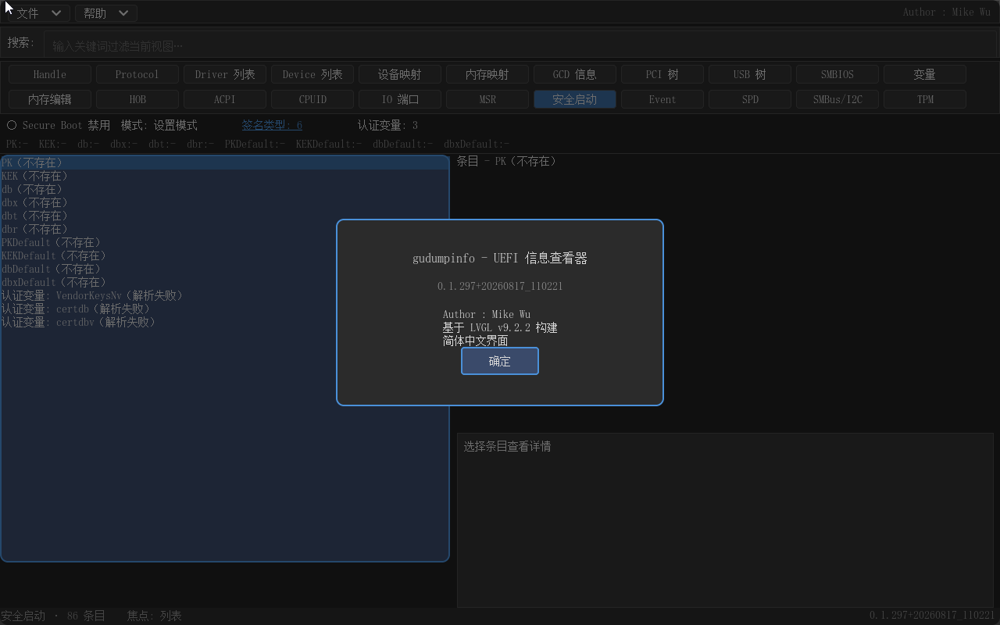

帮助菜单 → 关于：版本、作者与构建信息。


协议中心点击协议行 → 反查安装它的 handle 列表 → 点击跳回 Handle 视图定位。

## 产品手册

为第一次二进制发布编写，随发布物提供：

- **[功能演示 GIF](docs/manual/gudumpinfo-overview.gif)**：18 帧串联主界面与全部 18 个功能视图（每帧 1.2 秒循环播放）
- **[说明书（简版）](docs/manual/gudumpinfo-说明书-简版.md)**（[Word 版](docs/manual/gudumpinfo-说明书-简版.docx)）：一页半快览——功能一览表、独家亮点（协议反查、590 条可读协议名、CPUID 位域当前值、文件模式等）、三步上手
- **[说明书（详版）](docs/manual/gudumpinfo-说明书-详版.md)**（[Word 版](docs/manual/gudumpinfo-说明书-详版.docx)）：10+ 页完整手册——每个功能"怎么用 + 解决什么问题"，含全局搜索/文件模式/快捷键表/已知限制

## 依赖

本包**不包含** LVGL 移植层。构建需要以下独立仓库（以 `PACKAGES_PATH` 方式并列引入）：

| 依赖 | 仓库 | 说明 |
|---|---|---|
| LvglPkg | [MikeWuPing/UEFI_LVGL](https://github.com/MikeWuPing/UEFI_LVGL) | LVGL 9.2.2 官方镜像（原样内置）+ UEFI 适配层（GOP 显示/键盘/鼠标/内存/tick） |

ACPI 反编译引擎（AcpicaPkg，可选）独立开源在 [MikeWuPing/AcpicaPkg](https://github.com/MikeWuPing/AcpicaPkg)。

## 目录结构

```
gudumpinfo/
├── README.md                  # 本文档（中英双语）
├── LICENSE                    # MIT
├── .gitignore
├── GudumpInfoPkg/             # 应用包（EDK2 Package）
│   ├── GudumpInfoPkg.dec / .dsc
│   ├── Library/FixedDebugPrintErrorLevelLib/
│   └── Application/GudumpInfo/
│       ├── Core/              # 纯逻辑层（各视图模型/解析/渲染，不依赖 LVGL/UEFI 图形）
│       ├── Platform/          # UEFI 采集层（协议/内存/ACPI 表/CPUID 指令）
│       └── Ui/                # LVGL 呈现层（SplitView/TableView/HexEdit/CodeView/焦点管理）
├── tools/                     # 构建与验证脚本（New-BuildVersion / Build-HostTests / Run-Qemu*）
├── tests/host/                # 主机侧单元测试（VS2019 cl.exe 直编，6000+ checks）
├── qemu_disk/                 # QEMU 运行盘（gudumpinfo.efi + startup.nsh）
├── docs/manual/               # 产品手册（简版/详版 md + docx、演示 GIF、配图 24 张）
└── screenshot/                # 功能截图（01_main_handle.png ~ 24_proto_reverse.png）
```

## 构建

环境：EDK2 + VS2019。设好 WORKSPACE 与 `PACKAGES_PATH`（edk2 + UEFI_LVGL + AcpicaPkg + 本目录）后：

```cmd
# 双架构一键构建（版本只递增一次，产物分别 stage 到 qemu_disk / qemu_disk_a64）
powershell -ExecutionPolicy Bypass -File tools\Build-DualArch.ps1            # 默认 All：X64 + AARCH64
powershell -ExecutionPolicy Bypass -File tools\Build-DualArch.ps1 -Arch X64  # 单架构快速切换

# 或手工分步
powershell -ExecutionPolicy Bypass -File tools\New-BuildVersion.ps1
build -p GudumpInfoPkg\GudumpInfoPkg.dsc -a X64 -t VS2019 -b DEBUG
build -p GudumpInfoPkg\GudumpInfoPkg.dsc -a AARCH64 -t VS2019 -b DEBUG
```

产物：`Build/GudumpInfoPkg/DEBUG_VS2019/X64/GudumpInfo.efi` 与 `.../DEBUG_VS2019/AARCH64/GudumpInfo.efi`（同一工具链 tag，产物按 `-a` 自动分目录）。

**架构支持：** X64 与 AARCH64 一套源码（`SUPPORTED_ARCHITECTURES = X64|AARCH64`）。AARCH64 的 MSVC 路径需 VS2019 的 ARM64 编译工具（`Hostx64/arm64/cl.exe` + `armasm64.exe`）；x86 专属视图 **CPUID / IO 端口 / MSR 在 AARCH64 上自动灰调**（`GUDUMP_X86_VIEWS` 编译期门控），其余视图（含 Event/Timer、ACPI 反编译、Secure Boot、内存编辑）两架构一致；串口调试走固件的 `EFI_SERIAL_IO_PROTOCOL`（无硬编码地址，找不到时静默降级）。已验证于 QEMU virt（ArmVirtQemu/CLANGPDB 固件）与鲲鹏 920B 真机。固件构建（AARCH64 的 ArmVirtQemu）必须用 CLANGPDB 工具链（MSVC 编不了 .S 汇编，见 `patches/edk2-armvirt-usb-mouse.patch` 头部说明）。

## 运行

把 `gudumpinfo.efi`、`startup.nsh` 放进 QEMU 虚拟 FAT 盘启动：

```
Shell> gudumpinfo.efi
```

鼠标验证需要带 USB 鼠标驱动的 OVMF 固件（`-device usb-mouse`；上游 OVMF 默认不含，参见 UEFI_LVGL 仓库的补丁说明）。一键运行：`tools/Run-GudumpInfoQemu.ps1`（SDL 交互窗口）。

## 验证与取证

- **主机单元测试**（Core 纯逻辑层，无需 EDK2）：VS2019 `cl.exe` 直接编译 `tests/host/` 下用例，**6000+ checks / 0 failures**（含 CPUID 表完整性 2500+ 项、golden 真实 CPUID 数据 294 项）
- **CPUID 表由生成器维护**：`tools/GenCpuIdTable.py` 从 edk2 `MdePkg/Include/Register/Intel/Cpuid.h` 提取位域 → 生成 `CpuIdDefs.c`；新 leaf 人工从规范查证后补入 `tools/cpuid_data/new_leaves.h` 重跑生成器（edk2 升级可重生成）
- **QEMU 闭环取证**：串口断言（`APP_VERSION=` 与 expected_version.txt 一致）+ monitor screendump 截图 + sendkey/QMP 键鼠注入，全程无人值守（`tools/Run-QemuM10.ps1` 等）

## 截图展示

| 功能 | 截图 |
|---|---|
| 主界面（22 按钮）+ Handle 视图 |  |
| 协议中心（M16） |  |
| Driver 列表 |  |
| Device 列表（设备实例名） |  |
| 设备映射 | 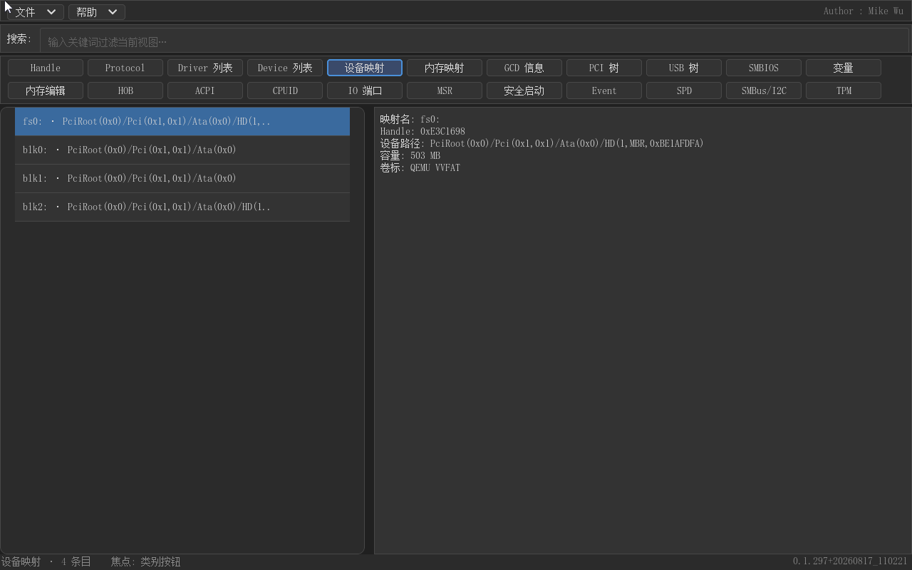 |
| 内存映射 | 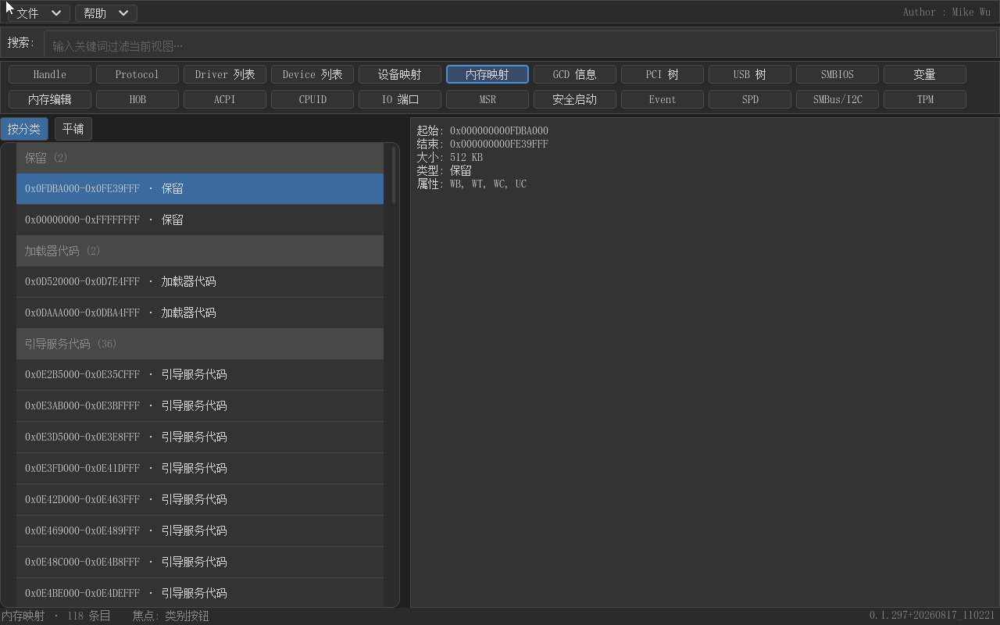 |
| GCD 信息 |  |
| PCI 树 | 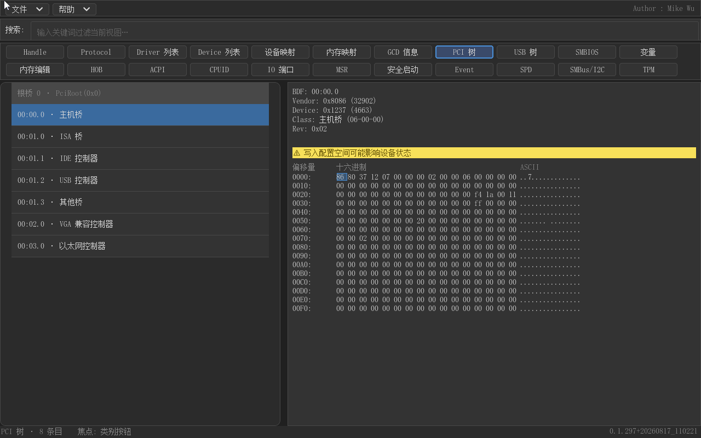 |
| USB 树 | 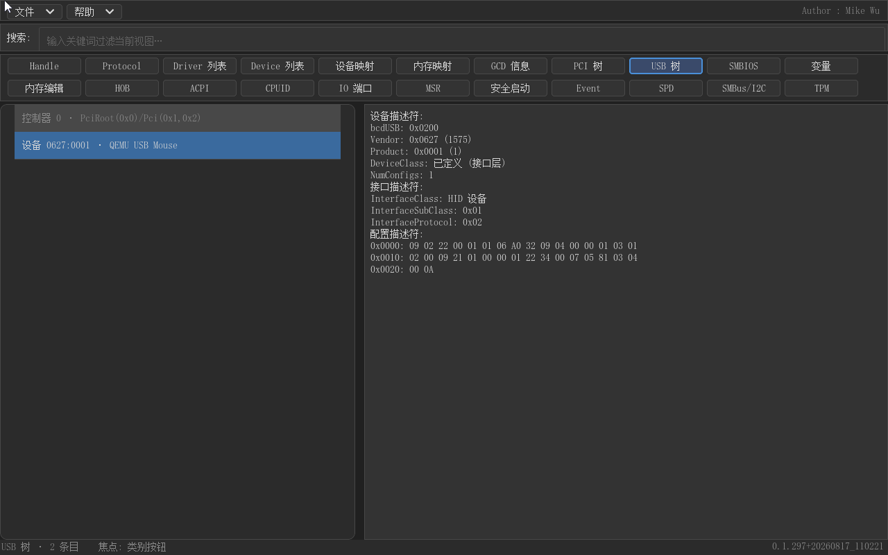 |
| SMBIOS |  |
| 变量 |  |
| 内存编辑 | 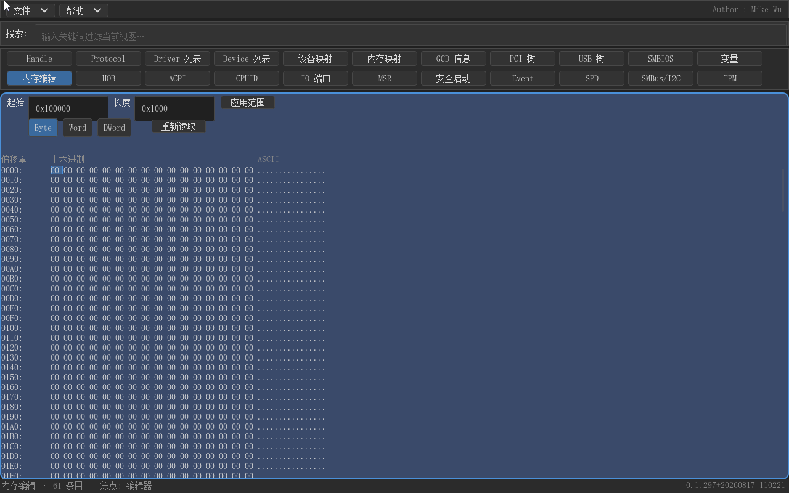 |
| HOB | 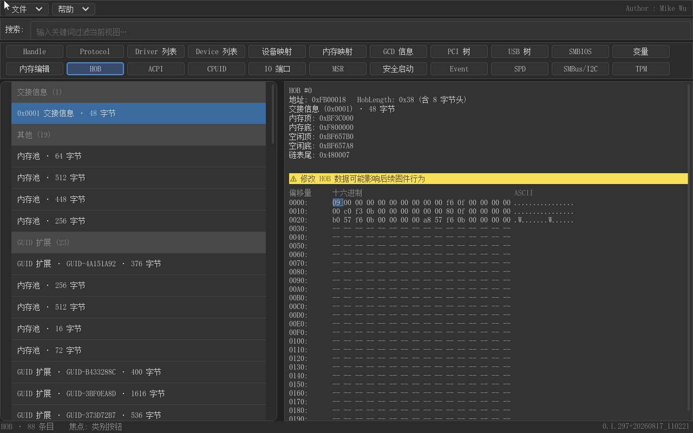 |
| ACPI |  |
| CPUID（位域值括注） |  |
| IO 端口 |  |
| MSR |  |
| Secure Boot |  |
| 搜索过滤（GOP） |  |
| 文件菜单 |  |
| 保存对话框 |  |
| 载入对话框 |  |
| 关于对话框 |  |
| 协议反查跳转 |  |

## 已知限制

- 只读当前执行 CPU（BSP）的 CPUID，不做 AP 遍历
- ACPI AML 编辑写回固件内存，同会话生效；重启后恢复（固件不重新解析表）
- 部分保留 leaf（规范未定义）仅显示原始寄存器值；QEMU TCG 对未实现 leaf 返回固定值，已单列"未定义"组展示
- IO 端口视图的写保护分级依据 PC/AT 体系公认语义；**QEMU 环境怪癖**：写 PIC 命令端口 0x20=0xFF（OCW3 特殊屏蔽模式）会破坏 OVMF 的 ACPI 定时器延迟服务导致客户机异常（已二分确证与 app 无关，真机无此问题），QEMU 验证因此跳过危险/致命写实验，仅验证普通读写与 PCI 配置读取
- Secure Boot 视图为**只读展示**（不含 enroll/写入操作）；QEMU 富内容验证需要自编译 OVMF（含 USB 鼠标驱动）并在 pflash 中预运行 `EnrollDefaultKeys.efi` 导入默认密钥（所需固件补丁见 `patches/edk2-ovmf-allow-unsigned-media.patch`）——默认 OVMF 下视图呈现未启用状态（Secure Boot 禁用、设置模式、各库"（不存在）"）
- Save/Load（M15）：IO 端口视图不支持保存/载入（其数据在真机上才有意义，菜单提示"该视图不支持保存"）；保存目标为卷根目录（fs0:/fs1:… 弹窗选择），文件名默认 `gud_<功能>_<时间戳>.gud` 可改；载入为**数据级回放**（内存编辑载入后仍是编辑器，编辑只改内存缓冲不落盘，Ctrl+R 即恢复实时）；`.gud` 文件为自定义格式（`GUDINFO` 签名 + 功能签名 + 双校验和），宿主校验脚本见 `tools/check_gud_file.py`
- ACPI 表头 Length 钳制（M15 修复）：部分固件（如 NUC8i7BE 的 AMI BIOS）的 DSDT 表头 Length 是编译时值（可到 256KB+），运行时表内存却被截断到 64KB 且表头未同步——按 Length 反编译会越界读表缓冲外内存而死机。app 在收集时用 GetMemoryMap 查表地址所在连续 RAM 描述符链，**把 Length 钳制到实际可读边界**（只缩不扩，能读多少是多少），反编译/校验和/HexEdit/保存全下游安全；保存按钳制后长度抓取完整可读数据（不再 64KB 截断）
- 大表反编译进度条（M15）：256KB 级 DSDT 反编译可达分钟级，反编译期间 ASL 分栏顶部显示**进度条**（按 AML 偏移推进，实时渲染），明确"界面活着"而非死机；反编译完成即消失。若输出缓冲增长失败（真机内存紧张），串口会打 `output grow fail ... TRUNCATED`（此前的静默截断会导致 ASL 显示不全）
- 设备实例名（M16）：设备名来自驱动 `ComponentName2->GetControllerName`（"en"→"eng" 两轮尝试），驱动未实现该接口或拒绝时该行省略；bus 驱动创建的 child 设备因驱动不对其持有 BY_DRIVER open 关系而拿不到名字（比 Shell `devices` 略窄）；搜索在 Pci/USB/SMBIOS/变量/HOB 等部分视图仍区分大小写（Handle/协议/CPUID/驱动/设备已统一不敏感，其余视图留待后续统一）

## 许可证

MIT License。参见 [LICENSE](LICENSE)。

---

## English

# gudumpinfo — Graphic UEFI System Info Viewer

gudumpinfo is a GUI system-information viewer that runs directly in the **UEFI Shell** — the UEFI-world equivalent of a desktop system-info tool, without any operating system underneath. Built on the LVGL graphics library with a fully simplified-Chinese UI (built-in SimSun CJK font) and mouse & keyboard input, it covers everything a firmware developer needs for day-to-day debugging: handles/protocols, devices, drivers, mappings, memory map, GCD, PCI tree, USB tree, SMBIOS, UEFI variables, HOB list, ACPI tables — and a deep **CPUID** analyzer. **Supports X64 and AArch64 from a single source tree** (the x86-only views CPUID / IO ports / MSR gray out automatically on AArch64; everything else works identically — see the Build section).

> In the firmware world, finding out what your CPU actually is — or what the ACPI tables really say — shouldn't require a command line.


- **Author**: Mike Wu
- **License**: MIT
- **GUI library**: [LVGL 9.2.2](https://lvgl.io) (open-sourced separately, see Dependencies)
- **UI language**: Simplified Chinese (built-in SimSun CJK font)
- **Product manual**: [Demo animation](docs/manual/gudumpinfo-overview.gif) ｜ [Brief manual](docs/manual/gudumpinfo-说明书-简版.md) ｜ [Detailed manual](docs/manual/gudumpinfo-说明书-详版.md)

## Features

- **19 information views + 5 upcoming placeholders** (button-navigated, 11-column button bar, 22 buttons in two full rows; Event/SPD/SMBus-I2C/TPM are upcoming-feature placeholders showing a "under development" notice when clicked):
  - **Handles/Protocols**: handle → protocols (**590+ entry readable-name table**: all edk2 packages + gEdkii + MTL platform protocols, with **common abbreviations** such as Graphics Output (GOP); each protocol row shows its **install count** "· N handles", click for reverse lookup) → DevicePath
  - **Protocols (M16)**: an **all-installed-protocols** center — left list (name + alias + install count, searchable) → right list of owning handles → click to jump back to the Handle view; .gud save/load supported
  - **Devices / Drivers / Mappings**: device paths, **device instance names** (best-effort via ComponentName2, e.g. "QEMU Video PCI Adapter"), driver bindings, fs0:/blk0: volumes
  - **Memory Map**: GetMemoryMap descriptors, grouped or flat
  - **GCD**: memory + IO space maps with sub-tabs
  - **PCI / USB trees**: full-scanned device trees, config-space hex viewer, Enter jumps to the device's handle page
  - **SMBIOS**: Type 0/1/2/3/4… field-by-field Chinese annotations
  - **Variables**: GetNextVariableName enumeration grouped by attribute (NV/RT/volatile)
  - **Memory Editor / HOB**: hex editor (direct UEFI memory read/write), HOB list + editor
  - **ACPI**: all tables grouped, plain tables field-decoded (FADT/MADT/FACS…), **AML tables (DSDT/SSDT) disassembled to ASL** with **ASL↔HEX bidirectional linking** (click an ASL line to highlight its byte range), editable HEX with **automatic checksum recalculation**
  - **CPUID**: full leaf collection (standard 0x00-0x2F + extended 0x80000000-0x26), **table-formatted bit-field decoding** — `Field | Bits | Value | Result | Description` per row, 1-bit feature bits show an explicit **Supported/Not-supported** conclusion; the description column appends the **current value** (enum Chinese name or decimal, e.g. `（当前: 8）`, M16); 41 leaf definitions, 2470 bit fields, 577 Chinese annotations (Key Locker/PCONFIG/LBR/AMX/TMUL/SGX/ArchPerfmon plus the full AMD Zen4/Zen5 set, all verified against Intel SDM / AMD APM); **platform recognition** (Meteor Lake/Arrow Lake/Panther Lake model tables from official EDS); three collapsible list groups (standard/extended/**undefined**)
  - **IO Ports**: x86 IO space (0x0000-0xFFFF) **read/write in Byte/Word/DWord widths** — windowed browsing (256 ports/window, no auto-read on paging), built-in **common-port annotation table** (~60 ports: DMA/PIC/PIT/keyboard/CMOS/POST/serial/parallel/ATA/VGA/PCI config, danger ports marked red/orange); **strong write protection**: zero access on entry, every access explicitly triggered; three-tier write control — single confirm for normal ports, **double confirm for danger ports** (PIC/PIT/DMA/CMOS/PCI config 0xCF8/0xCFC…), **hard reject for fatal ports** (reset 0xCF9/0x92, CMOS index 0x70, keyboard command 0x64, SuperIO index); width-alignment rule (odd ports Byte-only); side-effect read ports (0x60/0x64) warned; PCI config-space reads via 0xCF8 (address) + 0xCFC (data)
  - **MSR**: x86 model-specific register **read/write** — left grouped MSR list (**1359-entry auto-generated knowledge table**: 358 MdePkg architectural + 1001 MTL platform MSRs, addresses/names/bitfields/read-only flags, collapsible groups), right **64-bit value + per-bitfield decode table** (bits/field/value/description), **dedicated MTRR parsing** (PHYSBASE/PHYSMASK pairs resolve memory ranges: from-to, size, UC/WC/WT/WP/WB type; fixed-range segment summaries; DEF_TYPE default type + FE/E enable bits); top CPU summary bar (model/microcode/cache/cores-threads/frequency/temperature); **per-core selection + all-core batch read** (MP Services); **three-tier write protection** (fatal greyed / danger double-confirm / normal single-confirm, writes disabled by default until enabled in ⚙ settings); **danger-read blocking** (APIC/X2APIC registers that hang the machine shown in red and never read); optional **#GP-safe read hook** (EFI_CPU_ARCH_PROTOCOL, off by default)
  - **Event/Timer (new)**: full-system event & timer scan — memory scan of
  EDK2 IEVENT objects ('evnt' signature + multi-layer validation +
  self-calibration firmware check); left list grouped into **Event**
  (group/protocol-notification events, collapsible headers with counts)
  and **Timer** (periodic timers with estimated period & armed state);
  right detail per-field (type bits, notify TPL, notify function address
  with **module name** (OVMF GUID map / PDB reverse lookup on real
  DEBUG BIOS, DevicePath fallback), event group GUID, signal count,
  ExFlag, timer period/next-trigger); protocol-notification events show
  the **mounted protocol name** (e.g. Loaded Image); a **View Handle**
  link below the detail jumps to the Handle view; global search
  case-insensitive fuzzy match ("exit" hits ExitBootServices group
  events; also by protocol/module name, notify level); .gud save/load
  (168-byte fixed records)
- **Secure Boot**: read-only view of Secure Boot state and certificate stores — top **summary bar** (enabled/disabled badge + **derived mode**: Setup/User/Deployed/Audit from the SetupMode/DeployedMode/AuditMode state machine + signature-type count + authenticated-variable count, second row per-store `type:count` overview, click "签名类型:N" for the full list); left list of the **six standard signature stores** (PK/KEK/db/dbx/dbt/dbr) + the Default series (PKDefault/KEKDefault/dbDefault/dbxDefault) + **all authenticated variables** (EFI_VARIABLE_AUTHENTICATED_ACCESS_ACCESS third-party variables such as shim's MokList, name-sorted, capped at 64); right table of signature entries (index/type/subject CN or hash digest/size) with **detailed X509 certificate parsing** for the selected entry (hand-rolled light DER: subject/issuer CN/O/C/OU, serial number, validity period, public-key algorithm & bit length, **SHA256 fingerprint**); SHA256-hash signatures shown in full 32 bytes; missing stores greyed as "not present", signature-list overruns marked red "parse failed" without affecting other stores; Tab cycles the left store list / right entry list focus zones, Ctrl+F searches store names; all data comes from UEFI variables (SecureBoot/SetupMode/PK/KEK/db/dbx…), no enroll/write operations
  - **Save As / Load From File (M15)**: File menu "**Save current view as file…**" (Ctrl+S) / "**Load from file…**" (Ctrl+L) — dumps any view's raw collected data into a `.gud` file (volume picker + suggested name `gud_<feature>_<timestamp>.gud`), replayable **at the data level** on another machine or in QEMU (ACPI tables re-disassemble after load, the memory editor works on loaded data, status bar shows "已载入"); the file header carries the `GUDINFO` signature + per-feature signature + dual byte-sum checksums, and parsing tolerates corrupt/truncated records (bad records skipped, partially-usable files still load); **all 16 views except IO ports** are supported, loading auto-routes to the owning view, Ctrl+R returns to live data — save a real-machine failure site and reproduce it in QEMU
- **Search**: global search box, **case-insensitive** matching of titles, protocol names and **aliases** (typing "GOP" finds Graphics Output), hex leaf numbers, field names and Chinese descriptions
- **Keyboard focus**: Windows-style Tab zone cycling with focus highlight/lowlight; three-level Esc handling, Ctrl+R refresh
- **Custom table widget**: virtual scrolling (CodeView-style), no memory pressure on thousands of rows

## Dependencies

This package does **not** bundle the LVGL port layer. Build with the following independent repos side-by-side via `PACKAGES_PATH`:

| Dependency | Repo | Description |
|---|---|---|
| LvglPkg | [MikeWuPing/UEFI_LVGL](https://github.com/MikeWuPing/UEFI_LVGL) | LVGL 9.2.2 upstream mirror (untouched) + UEFI adaptation layer (GOP display / keyboard / mouse / memory / tick) |

The ACPI disassembler engine (AcpicaPkg, optional) is open-sourced separately at [MikeWuPing/AcpicaPkg](https://github.com/MikeWuPing/AcpicaPkg).

## Directory Layout

```
gudumpinfo/
├── README.md                  # This document (bilingual)
├── LICENSE                    # MIT
├── .gitignore
├── GudumpInfoPkg/             # The application package (EDK2 Package)
│   ├── GudumpInfoPkg.dec / .dsc
│   ├── Library/FixedDebugPrintErrorLevelLib/
│   └── Application/GudumpInfo/
│       ├── Core/              # Pure logic (view models / parsing / rendering, no LVGL/UEFI graphics deps)
│       ├── Platform/          # UEFI collection layer (protocols / memory / ACPI tables / CPUID)
│       └── Ui/                # LVGL presentation (SplitView / TableView / HexEdit / CodeView / focus mgmt)
├── tools/                     # Build & verification scripts (New-BuildVersion / Build-HostTests / Run-Qemu*)
├── tests/host/                # Host-side unit tests (VS2019 cl.exe, 6000+ checks)
├── qemu_disk/                 # QEMU boot disk (gudumpinfo.efi + startup.nsh)
├── docs/manual/               # Product manuals (brief/detailed md + docx, demo GIF, 24 screenshots)
└── screenshot/                # Feature screenshots (01_main_handle.png ~ 24_proto_reverse.png)
```

## Build

Environment: EDK2 + VS2019. With WORKSPACE and `PACKAGES_PATH` (edk2 + UEFI_LVGL + AcpicaPkg + this repo) set:

```cmd
# One-shot dual-arch build (single version bump; stages qemu_disk / qemu_disk_a64)
powershell -ExecutionPolicy Bypass -File tools\Build-DualArch.ps1            # default All: X64 + AARCH64
powershell -ExecutionPolicy Bypass -File tools\Build-DualArch.ps1 -Arch X64  # single-arch fast switch

# or step by step
powershell -ExecutionPolicy Bypass -File tools\New-BuildVersion.ps1
build -p GudumpInfoPkg\GudumpInfoPkg.dsc -a X64 -t VS2019 -b DEBUG
build -p GudumpInfoPkg\GudumpInfoPkg.dsc -a AARCH64 -t VS2019 -b DEBUG
```

Output: `Build/GudumpInfoPkg/DEBUG_VS2019/X64/GudumpInfo.efi` and `.../DEBUG_VS2019/AARCH64/GudumpInfo.efi` (same toolchain tag, output dirs separated by `-a`).

**Architecture support:** X64 and AARCH64 from one source tree (`SUPPORTED_ARCHITECTURES = X64|AARCH64`). The AARCH64 MSVC path needs VS2019's ARM64 build tools (`Hostx64/arm64/cl.exe` + `armasm64.exe`); the x86-only views **CPUID / IO ports / MSR gray out automatically on AARCH64** (`GUDUMP_X86_VIEWS` compile-time gating) while all other views — Event/Timer, ACPI disassembly, Secure Boot, memory editor — behave identically; the debug channel uses the firmware's `EFI_SERIAL_IO_PROTOCOL` (no hard-coded address, silent degradation when absent). Verified on QEMU virt (ArmVirtQemu / CLANGPDB firmware) and a Kunpeng 920B board. Building the AARCH64 firmware (ArmVirtQemu) requires the CLANGPDB toolchain (MSVC cannot build the .S assembly — see `patches/edk2-armvirt-usb-mouse.patch` header).

## Run

Place `gudumpinfo.efi` and `startup.nsh` on a QEMU virtual FAT drive:

```
Shell> gudumpinfo.efi
```

Mouse support requires an OVMF build with the USB mouse driver (`-device usb-mouse`; upstream OVMF lacks it by default — see the UEFI_LVGL repo for patches). One-click run: `tools/Run-GudumpInfoQemu.ps1` (SDL interactive window).

## Verification

- **Host unit tests** (Core pure-logic layer, no EDK2 needed): compiled directly with VS2019 `cl.exe` from `tests/host/`, **6000+ checks / 0 failures** (including 2500+ CPUID table-integrity checks and 294 golden checks against real host CPUID data)
- **CPUID tables are generator-maintained**: `tools/GenCpuIdTable.py` extracts bit fields from edk2 `MdePkg/Include/Register/Intel/Cpuid.h` → generates `CpuIdDefs.c`; new leaves verified against specs are added to `tools/cpuid_data/new_leaves.h` and regenerated (re-runnable on edk2 upgrades)
- **Closed-loop QEMU forensics**: serial assertions (`APP_VERSION=` matches expected_version.txt) + monitor screendump + sendkey/QMP keyboard & mouse injection, fully unattended (`tools/Run-QemuM10.ps1` etc.)

## Screenshots

| Feature | Screenshot |
|---|---|
| Main window (22 buttons) + Handle view |  |
| Protocols center (M16) |  |
| Driver list |  |
| Device list (instance names) |  |
| Device mappings |  |
| Memory map |  |
| GCD |  |
| PCI tree |  |
| USB tree |  |
| SMBIOS |  |
| Variables |  |
| Memory editor |  |
| HOB |  |
| ACPI |  |
| CPUID (field value suffix) |  |
| IO ports |  |
| MSR |  |
| Secure Boot |  |
| Search filter (GOP) |  |
| File menu |  |
| Save dialog |  |
| Load dialog |  |
| About dialog |  |
| Protocol reverse lookup |  |

## Known Limitations

- CPUID reads the current (BSP) CPU only — no AP traversal
- ACPI AML edits write back to firmware memory and take effect this session; a reboot restores the original (the firmware does not re-parse the tables)
- Some reserved leaves (undefined by the spec) show raw register values only; QEMU TCG returns a fixed value for unimplemented leaves — these are grouped separately under "undefined"
- IO write protection tiers follow widely accepted PC/AT semantics; **QEMU environment quirk**: writing the PIC command port 0x20=0xFF (an OCW3 special-mask command) breaks OVMF's ACPI-timer delay service and faults the guest (bisection-proven unrelated to the app; real hardware has no such issue) — QEMU verification therefore skips the danger/fatal write experiments and covers normal read/write plus PCI config reads
- The Secure Boot view is **read-only** (no enroll/write operations); rich-content verification under QEMU needs a self-built OVMF (with the USB mouse driver) plus `EnrollDefaultKeys.efi` run beforehand in pflash to import the default keys (firmware patch in `patches/edk2-ovmf-allow-unsigned-media.patch`) — stock OVMF shows the disabled state (Secure Boot off, Setup Mode, stores "not present")
- Save/Load (M15): the IO ports view does not support save/load (its data is only meaningful on real hardware; the menu says "该视图不支持保存"); files land in the selected volume root (fs0:/fs1:/…), the default name `gud_<feature>_<timestamp>.gud` is editable; loading is a **data-level replay** (the memory editor keeps editing loaded data — edits only touch the in-memory buffer, never the file, and Ctrl+R returns to live data); the `.gud` format is app-specific (`GUDINFO` signature + feature signature + dual checksums), host-side validation script: `tools/check_gud_file.py`
- ACPI header Length clamping (M15 fix): some firmware (e.g. NUC8i7BE AMI BIOS) ships a DSDT whose header Length is the compile-time value (up to 256KB+) while the runtime table memory is truncated to 64KB with the header not updated — disassembling by Length reads past the table buffer and crashes. On collect, the app uses GetMemoryMap to find the contiguous RAM descriptor chain containing the table and **clamps Length to the actually readable boundary** (shrink-only — keeps whatever is readable), making disasm/checksum/HexEdit/save safe downstream; save captures the full readable data (no more 64KB truncation)
- Large-table disassembly progress bar (M15): disassembling a 256KB-class DSDT takes minutes; during the pass a **progress bar** renders at the top of the ASL pane (advances by AML offset, live-refreshed) so the UI visibly stays alive instead of looking hung, and disappears when done. If the output buffer fails to grow (tight real-machine memory), the serial log prints `output grow fail ... TRUNCATED` (previously a silent truncation that showed as a partial ASL view)
- Device instance names (M16): device names come from the driver's `ComponentName2->GetControllerName` ("en" → "eng" two attempts); the row is omitted when the driver lacks the interface or refuses; child devices created by bus drivers get no name (the driver holds no BY_DRIVER open on them — slightly narrower than Shell `devices`); search remains case-sensitive in a few views (PCI/USB/SMBIOS/Variables/HOB — Handle/Protocols/CPUID/Drivers/Devices are unified, the rest left for a later pass)

## License

MIT License. See [LICENSE](LICENSE).
