# gudumpinfo 产品说明书（详版）

**UEFI 系统信息查看器 · 版本 0.1.297 · 2026-08-17**

---

## 前言

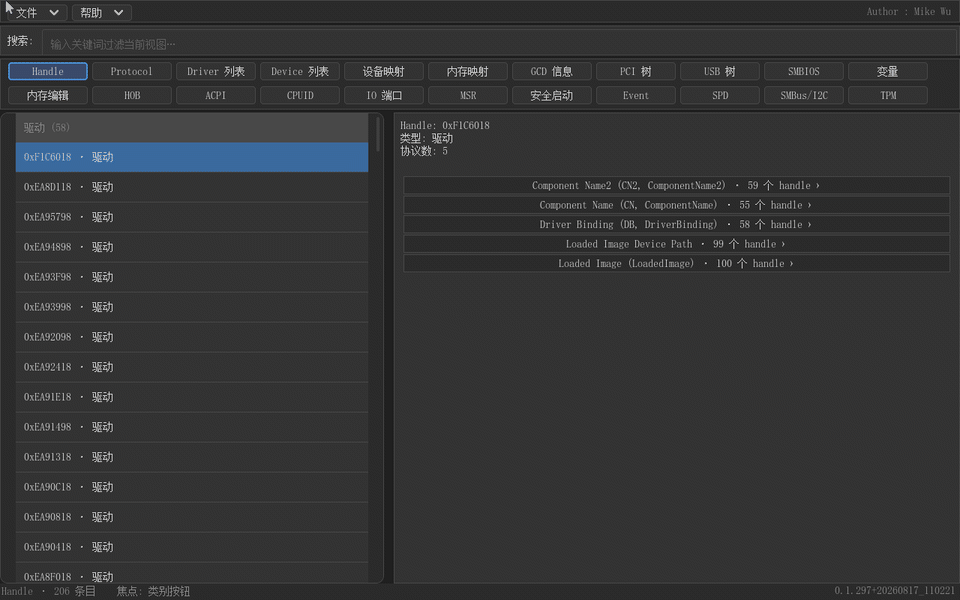

gudumpinfo 是一款运行在 UEFI Shell 环境下的 GUI 系统信息查看器。它以 LVGL 图形库为底层，提供简体中文界面，整体交互风格贴近 Windows 11，支持鼠标与键盘双输入。上面这段演示动画浓缩了它的核心能力：点击类别按钮在各信息视图之间切换、在搜索框输入关键词即时过滤、从协议反查挂载它的 handle、以及进入内存、IO 端口等调试视图进行读写操作。

这份说明书面向两类读者：一类是刚接触 UEFI 固件开发的工程师，希望用可视化的方式理解固件运行时环境；另一类是正在调试固件、驱动或平台的开发者，需要快速定位 handle、protocol、内存、ACPI 表等底层信息。全书按"概述—安装—界面—全局功能—分视图详述"的顺序展开，每个视图都配有真实运行截图，并说明"怎么用"与"解决什么问题"。

---

## 一、产品概述

做 UEFI 开发的人都有这样的体会：Shell 里并不缺命令，`dh`、`drivers`、`devices`、`map`、`memmap`、`pci`、`smbiosview`、`dmpstore` 各管一段，但它们都是纯文本输出，信息量大时滚动查找非常吃力；更重要的是，Shell 命令只能"正向"查看——想从某个 protocol 反查是哪些 handle 安装了它，或者从设备路径反查对应 handle，只能靠脚本遍历输出做二次加工。再加上信息无法可视化、结果难以导出存档，一次完整的系统排查往往要反复敲十几条命令、对着屏幕截图。

gudumpinfo 把这些问题收敛到一个图形界面里：所有信息按类别做成独立按钮，点一下即进入对应视图；每个视图内部是"左侧列表 + 右侧详情"的分区布局，配合全局搜索框做即时过滤；Handle、设备路径与 protocol 之间支持双向反查，从任何一侧都能跳到另一侧；每个视图都可以把当前内容保存为 .gud 文件，载入后离线复看。可以说，它把 UEFI Shell 世界里零散的信息查询命令，统一成了 Windows 资源管理器式的浏览体验。

下表列出 18 个已实现视图与 UEFI Shell 命令的对应关系，其中标"（无 Shell 命令）"的视图是 Shell 原生环境难以完成或需要专门工具才能获取的信息，正是本工具的价值所在。

| 视图 | 对应 Shell 命令 | 说明 |
|---|---|---|
| Handle | `dh` | handle 分组列表、挂载协议、设备名，支持协议/设备路径反查 |
| 协议中心 | `dh -p`（组合） | 全系统协议聚合：名称、别名、安装数，点击反查 handle |
| 驱动列表 | `drivers` | 驱动名（ComponentName2）、绑定控制器列表 |
| 设备列表 | `devices` | 有设备路径的 handle，按类型分组 |
| 设备映射 | `map` | fs0:/blk0: 映射、设备路径、容量、卷标 |
| 内存映射 | `memmap` | 内存描述符、类型、属性，按分类/平铺两种视图 |
| GCD 信息 | （无 Shell 命令） | GCD 内存/IO 空间描述符与状态 |
| PCI 树 | `pci` | 根桥分组、BDF 枚举、配置空间 Hex 查看 |
| USB 树 | `usbtree` | 控制器分组、设备/接口描述符、配置描述符 |
| SMBIOS | `smbiosview` | SMBIOS 各类型结构解码 |
| 变量 | `dmpstore` | UEFI 变量枚举、属性、数据 Hex |
| 内存编辑 | （无 Shell 命令） | 物理内存 Hex 查看与编辑（带风险防护） |
| HOB | （无 Shell 命令） | HOB 链表按类型分组浏览 |
| ACPI | （无 Shell 命令） | ACPI 表解析、AML 反编译、ASL/HEX 联动 |
| CPUID | （无 Shell 命令） | 全部 leaf 枚举、位域解析、当前值括注 |
| IO 端口 | （无 Shell 命令） | IO 端口窗口读取、分级确认写入 |
| MSR | （无 Shell 命令） | MSR 列表、位域解析、分级确认读写 |
| 安全启动 | （无 Shell 命令） | Secure Boot 状态、证书库、签名验证结果 |

## 二、安装与启动

gudumpinfo 以单个 .efi 文件发布（简体中文界面所需的中文字体已编译进二进制，无需额外文件）。把 `GudumpInfo.efi` 复制到任意一块 UEFI 可识别的 FAT 格式磁盘（U 盘、硬盘 EFI 分区、QEMU 的虚拟 FAT 盘均可），启动进入 UEFI Shell 后执行：

```
fs0:\> GudumpInfo.efi
```

也可以把该命令写入 `startup.nsh` 实现开机自动进入。程序启动后立即进入主界面，同时把版本号显示在画面右下角，便于与发布版本核对。

运行环境方面，程序需要 GOP 图形输出（UEFI 图形模式），这在所有支持图形界面的 UEFI 固件上都具备；键盘为基本输入设备，鼠标（PS/2 或 USB）可选但强烈建议——多数操作鼠标点击更直接。开发验证在 QEMU + OVMF 环境下完成，真机运行要求相同：只要 Shell 能起来、图形输出正常，gudumpinfo 就能运行。界面按 1280x800 分辨率设计，更低分辨率下界面会压缩但仍可使用。

## 三、界面总览


整个界面由五个区域构成，从上到下依次是：菜单栏、搜索栏、按钮区、内容区、状态栏。菜单栏左侧是"文件"与"帮助"两个下拉菜单，右侧显示作者信息；搜索栏是一个带"搜索:"标签的关键词输入框；按钮区两行共 22 个功能按钮，每行 11 个，是所有信息视图的入口；内容区是信息展示主体，绝大多数视图采用"左侧列表 + 右侧详情"的左右分区布局；状态栏显示当前视图名与条目数（左侧）以及当前焦点区域（右侧，格式为"焦点: 列表"之类）。

鼠标操作与桌面软件一致：单击按钮切换视图，单击列表条目查看详情，单击详情区的可点击行触发反查或跳转。键盘操作实现了 Windows 风格的焦点机制：按 Tab 在"菜单—搜索—类别按钮—列表—详情—编辑器"六个区域间循环，当前焦点区域有高亮边框、失焦后低亮；焦点在按钮区时，左右方向键切换类别按钮、上下方向键跨行移动；焦点在列表时，上下方向键移动选择、PageUp/PageDown 整屏滚动；ESC 是三级快捷键——先清除搜索框内容，再执行当前视图的"返回"语义（如反查结果回到列表），最后关闭弹出的对话框，按任意次都不会退出程序。

## 四、全局功能

### 搜索


搜索框支持对当前视图的实时过滤：点击搜索框（或按 Ctrl+F）输入关键词，列表立即重绘，只保留匹配条目，状态栏同步显示过滤后的条目数。搜索是大小写不敏感的子串匹配（对 ASCII 字符做大小写折叠），并且每个视图都有针对性的匹配范围——Handle 与设备视图会匹配 handle 十六进制（含补零与不补零两种写法）、类型名、协议名与协议别名；协议中心会匹配协议名、别名与 GUID；内存映射/GCD 匹配地址十六进制、类型名与属性名；CPUID 甚至能匹配位域名（搜 "SSE" 能命中 SSE3 位）。

协议别名是搜索体验的关键设计：UEFI 的 protocol 全名很长（如 Graphics Output Protocol），而别名来自内置的协议名对照表，输入 "GOP" 即可命中。上图中搜索 GOP 后，列表被过滤为挂载该协议的相关条目，方便快速定位。搜索无匹配时详情区显示"无匹配条目"，按 ESC 或清空输入框即可恢复完整列表。

### 文件菜单


"文件"菜单包含四项：刷新、保存当前视图为文件…、从文件载入…、退出。刷新（Ctrl+R）重新采集当前视图的实时数据——在内存编辑、IO 端口这类内容可能变化的视图中尤其有用；退出（Ctrl+Q 等效）干净地结束程序返回 Shell。

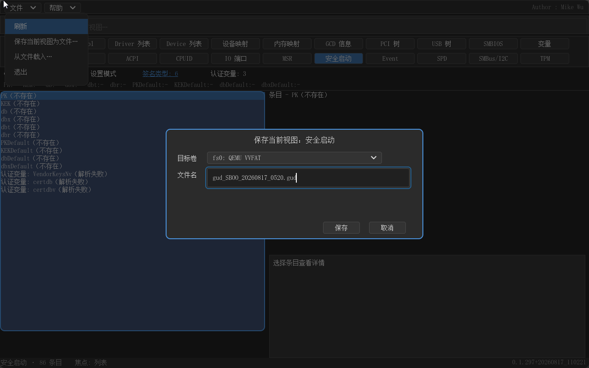

保存（Ctrl+S）把当前视图的内容写入 .gud 文件。对话框提供卷选择（fs0:、blk 上的文件系统等）、文件名输入与保存/取消按钮，文件名默认按 `gud_<视图>_<时间戳>.gud` 生成；文件已存在时会弹出覆盖确认。内存编辑视图的保存对话框还会多出"范围"输入，可以只导出指定地址区间的内存转储（上限 1MB）。保存成功后状态栏显示"已保存 fs0:\xxx.gud"。18 个信息视图全部支持保存（IO 端口视图除外，它是纯实时操作型视图）。


载入（Ctrl+L）从 .gud 文件恢复某个视图的快照：对话框列出所选卷上的全部 .gud 文件，选中后先解析、再弹出确认框（"该文件是 XX 视图数据（N 条目，时间戳 …），载入并切换到 XX 视图?"），确认后自动切换到对应视图并显示文件数据，状态栏提示"已载入（文件数据）"。.gud 是带魔数、视图标识与校验和的二进制格式，可以从 UEFI 环境拷出到主机存档，或日后在任意机器上重新载入查看；对内存转储类文件，载入后依然可以进入 Hex 编辑器查看，只是编辑落在缓冲区而不会写回真实内存。文件模式下刷新（Ctrl+R）会先退出文件模式再重新采集实时数据。

### 帮助与关于


"帮助"菜单目前提供"关于"一项，弹出关于对话框，显示程序名（gudumpinfo - UEFI 信息查看器）、版本号、作者与构建信息（基于 LVGL v9.2.2 构建、简体中文界面）。按 ESC 或点击"确定"关闭。

## 五、功能详述

### 5.1 Handle


Handle 是 UEFI 固件运行时的基础对象：每个已安装的驱动、控制器、设备、文件系统都以一个 handle 存在，handle 上挂载 protocol。Handle 视图把全系统的 handle 按类型分组展示——驱动、控制器、设备、块设备、文件系统、控制台、其他，每组带一个"类型名（数量）"的组头，双击组头可以折叠/展开整组，便于在 handle 数量成百上千的平台上快速定位。

列表每行显示 handle 值与设备路径摘要（如 `0x03A · PciRoot(0x0)/Pci(0x2,0x0)`），右侧详情给出该 handle 的类型、协议数、设备路径全文，以及通过 ComponentName2 协议取得的设备实例名（驱动句柄除外）。详情下方逐行列出挂载的每个协议，格式为"协议名（别名）· N 个 handle ›"——这个 N 就是该协议在系统中的安装数徽标，末尾的"›"提示这一行可以点击。点击协议行进入**协议反查模式**：列表切换为所有安装了该协议（或设备路径完全匹配）的 handle，ESC 返回。这就在"handle → 协议"之外补上了"协议 → handle"的反向通道。

Handle 视图解决的核心问题是身份追踪：拿到一个陌生 handle 值，能立刻看清它是什么、挂了哪些协议、对应的设备路径是什么；反过来，调查某个协议（比如谁安装了某个自定义 protocol）时，一次点击就能列出全部相关 handle。

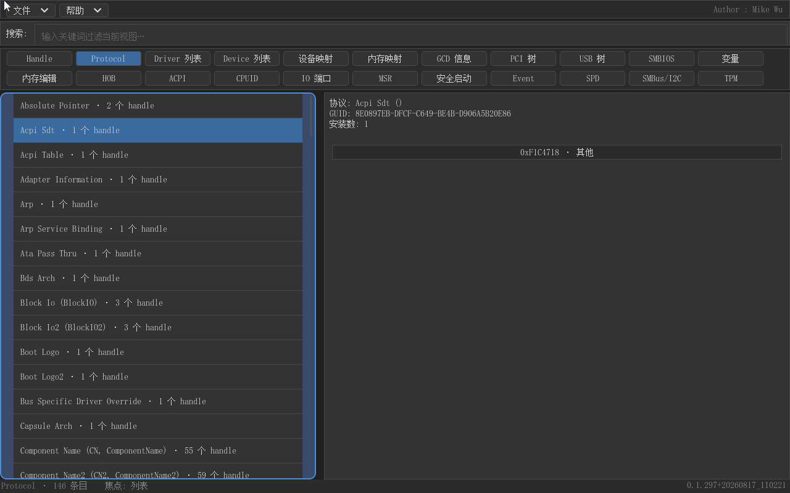

上图为协议反查模式下的列表效果：点击某个协议行后，左侧列表切换为所有安装该协议的 handle（标题行带反查提示），右侧详情保持被查协议与目标 handle 的信息；再次点击其他协议行或按 ESC 即可回到完整列表。设备路径行的反查语义相同，只是匹配条件改为设备路径精确匹配。

### 5.2 协议中心


协议中心是对 Handle 视图的全局化扩展：它遍历所有 handle 上安装的全部协议，按 GUID 去重聚合，得到一张"系统协议总表"，按协议名升序排列。每一行同样显示"协议名（别名）· N 个 handle"的聚合徽标；未知 GUID 直接以十六进制显示。右侧详情给出协议全名、GUID 与安装数，下方每行一个安装该协议的 handle（复用 Handle 视图的条目标题格式）。

点击某个安装 handle 行，会跳转到 Handle 视图并定位到该 handle——注意这种跨视图跳转会先清空搜索词，保证目标 handle 完整可见。搜索框在协议中心里可以按协议名、别名或 GUID 十六进制过滤，例如输入 "GOP" 立即找到 Graphics Output Protocol 的所有安装点。对固件开发者来说，这个视图回答了一个高频问题："系统里到底有哪些协议、各安装了多少份？"——比逐个 handle 翻看高效得多，也是排查协议接口重复安装、句柄泄漏等问题的起点。

### 5.3 驱动列表

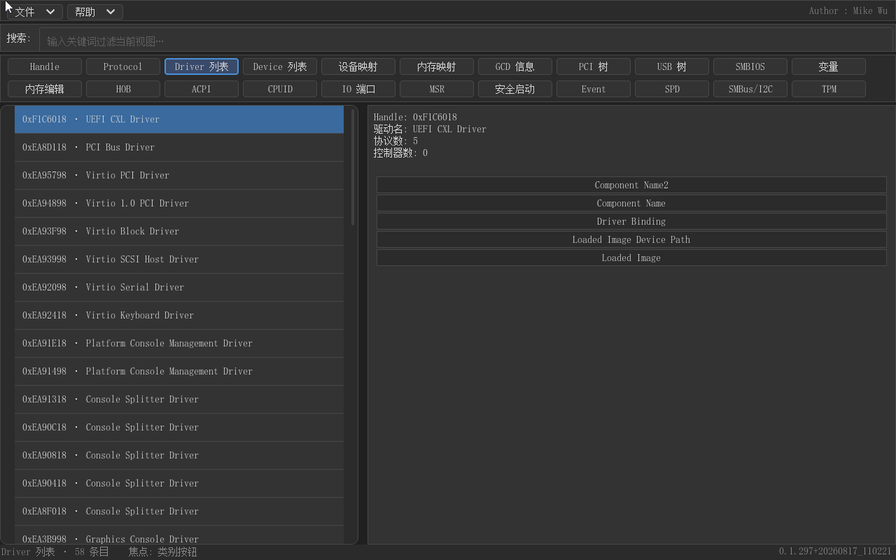

驱动列表只展示类型为驱动的 handle，每行格式为"handle 值 · 驱动名"，驱动名通过 ComponentName2 的 GetDriverName 获取，取不到时显示"未知驱动"。右侧详情除驱动句柄自身信息外，额外列出该驱动绑定的控制器列表——每一行是一个控制器句柄及其设备路径摘要。

点击某个绑定控制器行，进入驱动视图的**子视图**：详情区切换为那个控制器句柄的完整信息（摘要、协议行、设备路径行），顶部提供可点击的"← 返回驱动列表"行，按 ESC 同样返回。子视图是只读的"窥视"——想看控制器的协议反查，切到 Handle 视图即可。这个视图对应 Shell 的 `drivers` 命令，但把"哪个驱动绑了哪些控制器"的对应关系可视化出来，排查驱动绑定失败、控制器被谁接管这类问题时非常直观。

### 5.4 设备列表

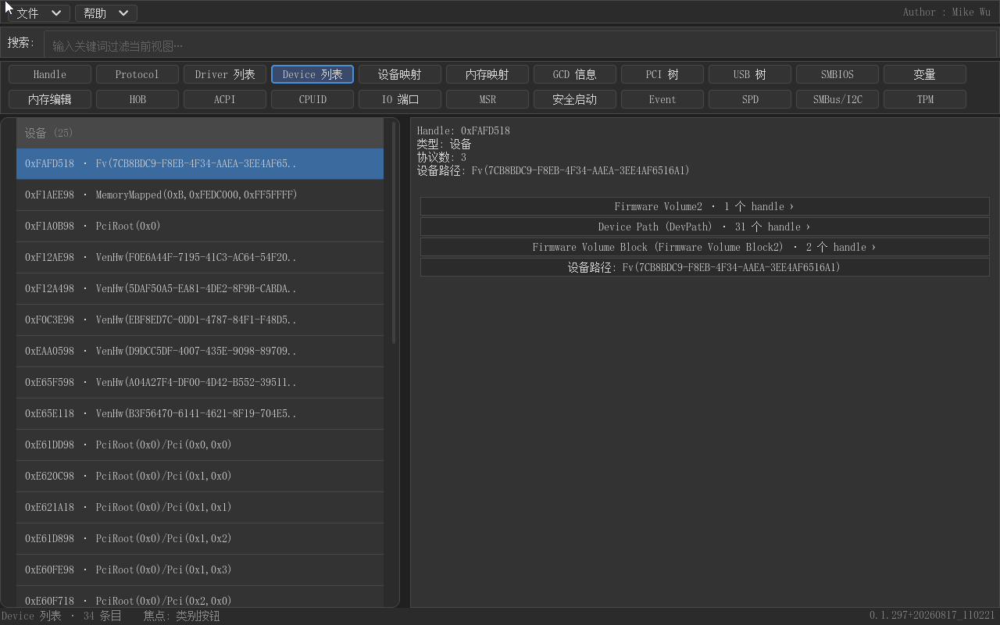

设备列表是 Handle 数据的一个过滤视图：只保留带有设备路径的 handle（即 Shell `devices` 语义），并按类型分组展示，组头格式为"类型名（数量）"。详情与 Handle 视图完全一致，同样支持协议行反查与设备路径行反查，反查结果包含所有匹配 handle 而不限于设备。设备列表解决"这台机器上有哪些设备"的速览问题，比在 Handle 全量列表里翻找省事得多。

### 5.5 设备映射


设备映射视图对应 Shell 的 `map` 命令：列出固件建立的块设备与文件系统映射，每个映射一行，标题为"映射名 · 设备路径摘要"（fs 条目在前、blk 条目在后，编号规则与 Shell 一致）。右侧详情给出映射名、handle 值、设备路径全文、容量（由块大小 × 块数计算）与卷标；无媒体的块设备显示"（不可用）"。

这个视图解决的是"我的 U 盘是哪一块、卷标叫什么、容量多大"这类问题——在 Shell 里执行 `map` 只能看到映射名与设备路径，容量与卷标需要额外工具；这里一次看全。装系统、调启动路径、找 VVFAT 测试盘时尤其顺手。

### 5.6 内存映射


内存映射视图通过 GetMemoryMap 获取固件当前的内存描述符表，按地址排序展示。内容区列表上方有一个"按分类/平铺"页签条：默认按分类模式把描述符按 EFI_MEMORY_TYPE 分组（组头如"常规内存 (12)"），平铺模式则是全量地址排序、无组头。双击组头可折叠分组。右侧详情给出每段内存的起始地址、结束地址、大小（MB 显示，小于 1MB 用 KB）、类型名与属性列表（如写回、可执行等，即 MemAttrs 风格输出）。

搜索按地址十六进制（大小写两种形式）、类型名或属性名匹配，例如输入某段保留内存的地址就能定位到它。这个视图是排查"内存为什么少了一块""这段保留区是谁声明的"的首选工具——相比 `memmap` 的纯文本，分组与折叠让上千个描述符的表变得可读。

### 5.7 GCD 信息

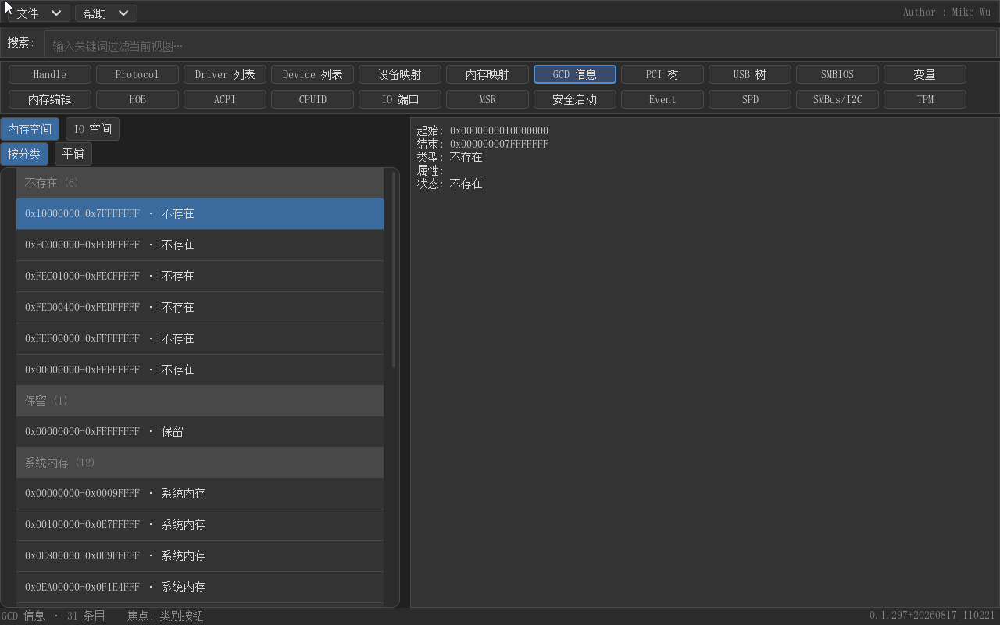

GCD（Global Coherency Domain）是固件对内存与 IO 空间的全局视图，驱动通过 AllocateMemorySpace/AllocateIoSpace 等 GCD 服务申请资源。GCD 视图在列表上方堆叠了两行页签：第一行"内存空间/IO 空间"选择空间类型，第二行"按分类/平铺"选择布局方式，四种组合自由切换。分类模式下内存空间按 GCD 类型（如非保留、系统内存、MMIO）分组，IO 空间按 IO 类型分组。

详情区给出每段描述的起始/结束地址、类型名、属性列表与状态——"存在/不存在"标志，后者对应 GCD 描述符的 Present 位，用来判断某段资源是否已被系统占用。这个视图在 Shell 里没有对应命令，是排查资源冲突（两个驱动申请同一段地址）、理解 PCI MMIO 窗口如何被分配的核心工具。

### 5.8 PCI 树


PCI 树视图通过 RootBridgeIo 协议对每个根桥做全扫描，按"根桥分组"组织：每个组头是"根桥 N · 设备路径文本"，组内条目按 BDF 枚举顺序排列。选中一个设备后，右侧详情除文本摘要（BDF、类代码/子类/编程接口、厂商/设备 ID、BAR 等）之外，还内嵌一个 256 字节的**配置空间 Hex 编辑器**，可以逐字节查看修改配置空间（写回立即生效并回读验证）。双击根桥组头可折叠整组，应对多根桥平台。

列表上按 Enter 会把当前设备跳转到 Handle 视图并定位到它的 PciIo handle——同一设备的两种视角（配置空间视角与 handle/protocol 视角）由此打通。搜索按 BDF、类名等匹配。PCI 树解决的是 Shell `pci` 命令的增强需求：层级结构、配置空间可视编辑、与 Handle 世界的联动。

### 5.9 USB 树


USB 树视图基于 UsbIo 协议做平面枚举，按控制器分组展示（组头"控制器 N · 设备路径"，无法归组的设备归入末尾"其他"组）。右侧详情显示设备/接口描述符的关键字段（设备描述符的 VID/PID、类代码，接口描述符的接口类/端点数等），并附配置描述符的完整 hex dump，供对照协议栈解析。

与 PCI 树一样，列表按 Enter 跳到该设备的 Handle 页面。这个视图对应 Shell 的 `usbtree`，但以图形树形分组呈现，且能直接看到配置描述符原始字节——调试 USB 设备枚举失败、端点配置异常时，无需再依赖第三方工具抓描述符。

### 5.10 SMBIOS

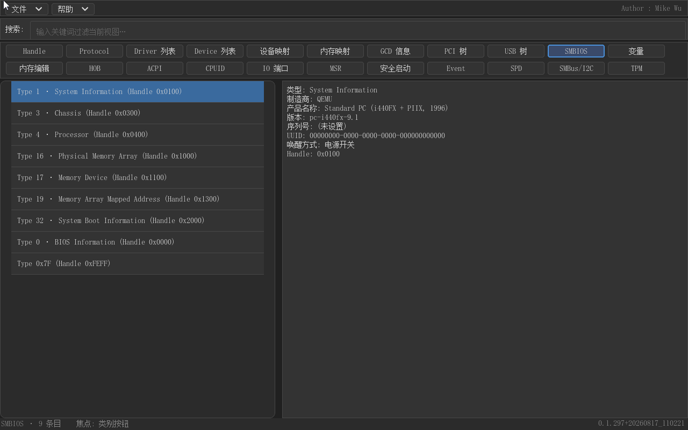

SMBIOS 视图读取固件的 SMBIOS 表区，把每个结构（Type 0 到 Type 127）解析后以中文可读文本呈现：左侧列表每行一个结构（类型名 + 序号），右侧详情按字段逐行解释——例如 Type 0（BIOS Information）的厂商、版本、发布日期，Type 1（System Information）的制造商、产品名、序列号，Type 17（内存设备）的容量、速率、制造商等。

解析覆盖常见类型并做了边界防护（结构长度异常时按规范截断而不是越界读取）。在 Shell 里 `smbiosview` 的输出是全英文的密集文本，本视图的价值一是中文，二是按结构索引、点哪看哪——查"这台机器内存条是什么型号"这类问题时，从列表滚动到 Type 17 即可。

### 5.11 变量

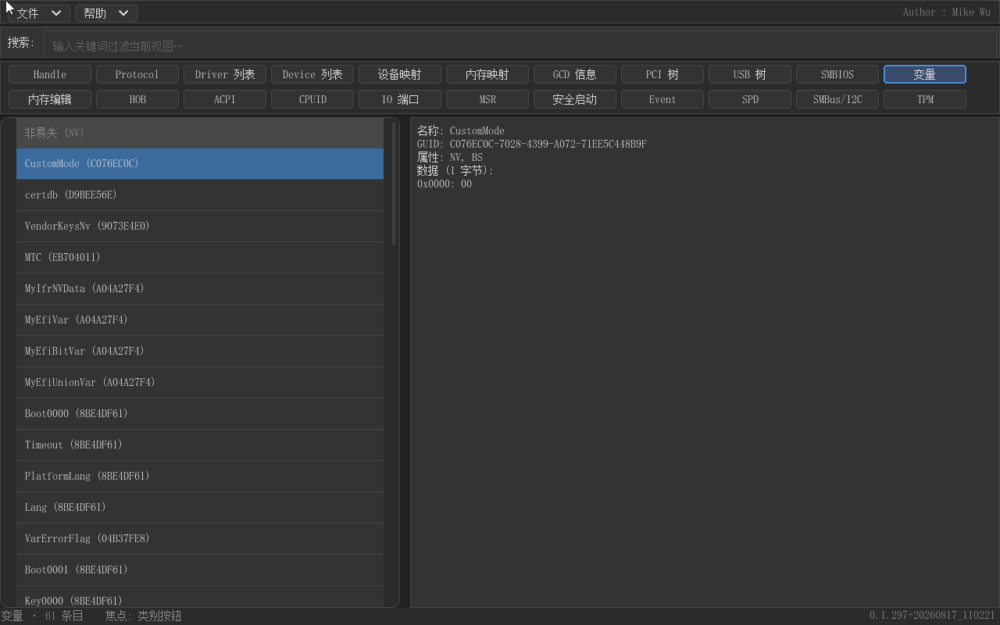

变量视图通过 GetNextVariableName 枚举全部 UEFI 变量，按属性分组展示：非易失（NV）、运行时（RT）、易失，组头带数量。右侧详情给出变量名、完整的 Vendor GUID、属性位说明与数据内容（hex dump，超过 256 字节自动截断并标注）。

这是 Shell `dmpstore` 的图形化版本，但交互上强得多：按变量名搜索（搜索框直接过滤）、按属性分组、双击组头折叠，几百个变量的局面变得可管理。排查启动配置、检查固件设置的残留变量、确认某个驱动写入的变量是否存在时，这是最快的一条路。

### 5.12 内存编辑


内存编辑视图是完整的物理内存 Hex 编辑器，采用自定义内容布局而非左右分区。顶部控制条提供"起始"与"长度"两个地址输入框（十六进制，0x 前缀可省）与"应用范围"按钮，按下 Enter 或点击按钮即把编辑窗口跳到指定区间；第二行是编辑宽度页签（Byte/Word/DWord）与"重新读取"按钮。默认窗口是 0x100000 起始、0x1000 长度（QEMU 常规 RAM），长度上限 1MB；每次离开视图都会重置回默认值。

编辑器本体支持 HxD 风格的键盘输入：hex/ASCII 两列，Tab 在列间切换（再按一次 Tab 逃出编辑器区域回到全局焦点循环），方向键移动光标，直接输入十六进制/ASCII 即写回内存并回读刷新，半输入状态以"_"补位显示。写操作有明确的风险防护：应用范围时程序检查目标区间是否位于 RAM 内，不在 RAM 时显示黄色警告条"⚠ 地址 0x… 不在 RAM 内，编辑可能导致崩溃"；写入失败（如访问不可读地址）时状态栏提示"写入失败"。

这个视图解决的是固件调试中的"看内存、改内存"刚需：检查某个结构是否按预期写入、临时修改数据观察行为。结合"保存为文件"可以把任意区间导出为内存转储存档。请务必只在明确理解后果的前提下修改物理内存。

### 5.13 HOB


HOB（Hand-Off Block）是 PEI 阶段向 DXE 阶段交接信息的链表，包含内存资源描述、固件卷位置、GUID 扩展数据等。HOB 视图通过 GetHobList 取得链表，按类型分成六组展示：交接信息、资源描述符、内存分配、GUID 扩展、固件卷、其他，组头带条目数。

选中一个 HOB 后，右侧详情显示解析后的文本摘要（如资源描述符的类型、物理起始地址与长度、资源属性），并在下方内嵌该 HOB 数据区的 Hex 编辑器，可以查看甚至修改原始字节。对研究平台内存布局、跟踪 PEI 阶段数据的人来说，这个视图让原本只能靠调试器或代码逐项遍历的链表变得可以直接浏览。

### 5.14 ACPI


ACPI 视图通过 EFI_ACPI_SDT_PROTOCOL 枚举全部 ACPI 表，分四组展示：根表（XSDT/RSDT）、结构解析、AML 表、其他。普通表（如 FADT、MADT）的详情是解析后的文本摘要，并内嵌 Hex 编辑器，修改会立即写入表内存并**自动重新计算表头校验和**——固件不会重新解析这些表，因此同会话内启动操作系统即生效，重启后恢复原状（视图内对此有明确警示）。

AML 表（DSDT/SSDT）的详情是增强的左右分栏：左侧是 AML 反编译出的 ASL 文本（只读 CodeView），右侧是 8 字节/行的 HEX 编辑器，两栏双向联动——点击 ASL 行，右侧 HEX 高亮对应字节区间；点击 HEX 字节，左侧 ASL 滚动到对应行。改动 HEX 后进入脏状态，联动暂停并提示刷新；点击"[刷新并重新计算校验和]"按钮或按 Ctrl+Tab 重新反编译并重建分栏。这是 Shell 里完全没有的能力：不开 OS 就能看 DSDT 源码。

DSDT 反编译是进入 AML 表详情时自动触发的：选中左侧"AML 表"组里的 DSDT 或 SSDT 行，程序即调用 ACPICA 引擎把 AML 字节流反编译为可读的 ASL 源码，左栏逐行展示（行号 + 缩进的嵌套结构），右栏同步呈现原始 AML 字节。选中某行 ASL 时，右侧 HEX 自动高亮对应的字节区间，反之点击 HEX 字节也会让左栏滚动到对应行，两栏互为索引。表较大（如 256KB 级 DSDT）时反编译可达分钟级，期间 ASL 分栏顶部显示按 AML 偏移推进的进度条，界面保持响应，反编译完成进度条即消失。

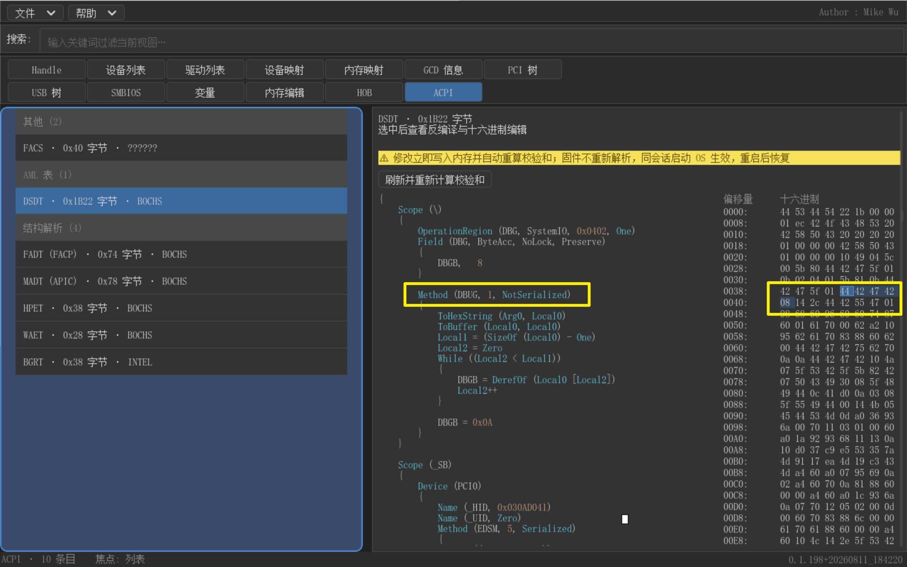

**修改 DSDT 的完整流程**：在右栏 HEX 编辑器中把光标移到目标字节（hex/ASCII 两列，Tab 切换，方向键移动），直接键入新值即写回该表在固件内存中的原始位置。每次写回后程序**立即自动重算表头校验和**——表头第八字节会被修正为正确的值，不用手工计算，写回的表始终是"合法表"。

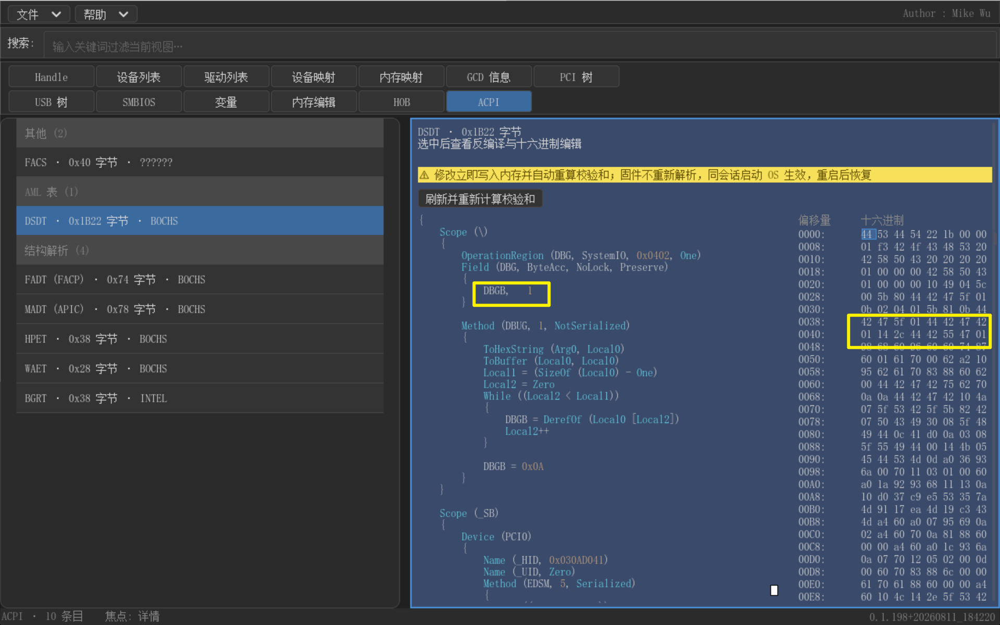

分栏上方有一行 [刷新并重新计算校验和] 按钮：修改后点击它（或按 Ctrl+Tab），程序重新反编译当前内存中的表并重建分栏，修改过的字节在 ASL 中可见——下图中修改的字节已经体现在重新反编译出的 ASL 行里。若在改动后未刷新时点击 ASL/HEX 联动区域，程序会因"脏状态"暂停联动并提示先刷新。

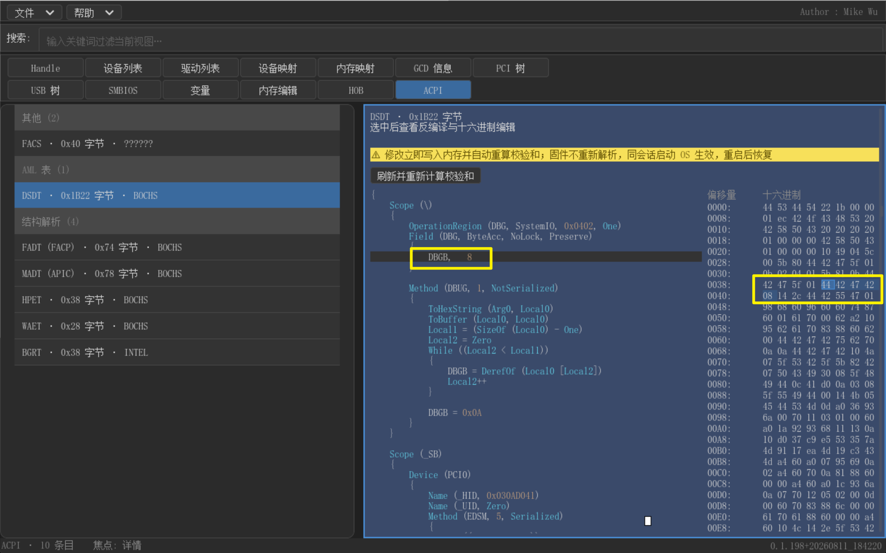

修改的生效范围需要明确：这些写回直接落在固件保留的 ACPI 表内存上，**同会话内启动操作系统会读到修改后的表**（可用于调试 Linux 的 ACPI 解析流程），但固件不会重新解析这些表，**重启后恢复原状**，视图内对此有明确警示。配合"保存当前视图为文件"（Ctrl+S），可以把修改后的整表导出为 .gud 快照带走，在另一台机器上载入后重新反编译查看。对做 ACPI 调试的人来说，这个视图把以往"提取表 → 主机侧反编译 → 修改 → 重新打包刷固件"的冗长循环，压缩成了固件环境内的直接操作。

### 5.15 CPUID


CPUID 视图枚举处理器支持的全部 CPUID leaf（标准区 0x00–0x2F 与扩展区 0x80000000–0x80000026，外加有返回值但规范未收录的"未定义"组），按三组列出；全零且未定义的 leaf 不出现在列表中以免噪音。右侧是每个 leaf 的**位域表格**：字段名、位宽、寄存器值、解释与结果，解释后还括注当前值——枚举字段标注命中的枚举名（如 CPUID 0x01 的步进型号），数值字段标注十进制当前值，无需自己对着位宽算。

搜索支持位域名匹配（搜 "SSE" 命中 0x01 的 SSE3 等），便于快速定位某个特性位。对驱动与固件开发者来说，这个视图替代了反复写 `cpuid` 内嵌汇编调试代码的流程：特性支持、缓存拓扑、虚拟化位一目了然。

### 5.16 IO 端口


IO 端口视图以窗口方式浏览 x86 IO 空间：控制条输入起始端口地址后点击"读取"（或按 Enter），按当前宽度（Byte/Word/DWord 页签）从该地址起连续读取 256 个端口，窗口表格显示端口地址、名称注解与值。翻窗用 PageUp/PageDown 一次移动 256 行，翻窗后缓存清空、需重新读取。若窗口内含有副作用读端口（如 0x60/0x64 键盘控制器数据/状态端口），警告条会提示"读会清状态/消费数据"——读取全部是显式触发，不会在用户未操作时静默访问。

写入是分级防护的：底部操作条显示当前选中端口的名称与等级徽标（无/危险/致命），"写入值"输入框按宽度做十六进制上限校验，超范围直接拒绝。致命端口（如 0xCF9 硬复位）的写入按钮直接置灰并提示"该端口写入可能导致系统崩溃/复位，已禁用"；危险端口写入弹红色确认框，确认后还要再弹一次"仍要写入？"才执行；普通端口一次确认即可。写入后自动回读刷新缓存。

IO 端口视图解决的是 Shell 无法完成的工作：读 0x80 诊断端口、检查 8259/8254 等传统控制器状态、验证某端口写保护是否生效。请始终注意：对错误端口的一次写入可能立刻蓝屏或复位。

### 5.17 MSR

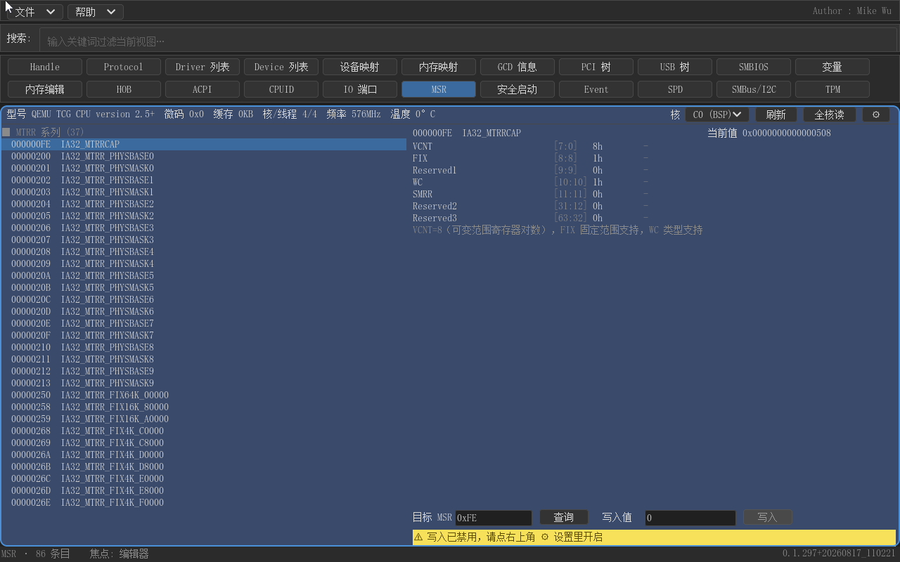

MSR 视图是处理器模型专属寄存器（Model-Specific Register）的完整工作台。顶部摘要条显示型号名、微码版本、缓存总量、核/线程数、频率与温度（BSP 值），右侧核选择下拉（C0 (BSP)、C1…）切换读写目标核，另有刷新、全核读与设置三个按钮。左侧是分组的知识库 MSR 列表，右侧展示选中 MSR 的标题（含 [致命]/[危险]/[只读] 标记）、当前值与位域解析表——与 CPUID 同样的字段级解析，并对 MTRR 系列做了专门解读（如可变范围寄存器配对计算区间、默认类型与启用状态）。

读取有风险门禁：钩子未开启且本视图内未确认过时，第一次读取会弹"MSR 读取风险确认"模态框——读取不支持的 MSR 可能触发 #GP 异常导致死机，建议先在 ⚙ 设置中开启"安全任意地址读"（注册 #GP 钩子，固件需支持 CpuArch 协议，不支持时会如实提示并回滚开关）。危险读地址（如 IA32_APIC_BASE 0x1B 与 X2APIC 空间 0x800–0x8FF）被直接拦截，红字警示不予读取。"全核读"弹模态面板逐核读取当前 MSR，无响应的核显示"该核无响应"、GP# 显示"MSR 不可用 (GP#)"。

写入默认禁用，需在 ⚙ 设置对话框中打开"允许 MSR 写入"开关；之后按三级确认链执行：致命 MSR 与只读 MSR 的写入按钮置灰，危险 MSR 二次确认，未知 MSR 一次确认并附带风险提示。写入后自动回读。这个视图把以往只能靠 `rdmsr/wrmsr` 汇编片段或专用工具完成的工作，变成了一个带知识库与防护的可视化工具。

### 5.18 安全启动

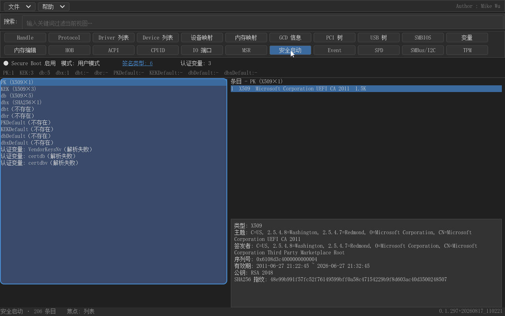

安全启动视图展示 Secure Boot 的完整状态。顶部摘要行显示：Secure Boot 启用/禁用（●/○ 图标）、当前模式（用户模式/设置模式/审计模式/部署模式）、签名类型数量与认证变量数量；"签名类型: N"是一个可点击的链接式文本，点击弹出签名类型卡片（列出系统支持的签名类型列表，如 X509、SHA256 等）。第二行给出各标准库的条目数（PK、KEK、db、dbx 等），认证变量收集达到上限时追加"（认证变量已截断）"提示。

左侧是库列表（标准库 + 认证变量），右侧上方是选中库的条目列表，下方是条目详情：X509 证书条目解析出主题、序列号、有效期、公钥算法与 SHA256 指纹，SHA256 哈希条目直接显示 32 字节哈希，未知类型显示原始数据 hex。这个视图对应固件设置的 Secure Boot 界面，但直接读取变量数据：排查证书是否过期、指纹是否匹配、dbx 是否挡住某个签名，都比进固件设置界面快得多。

## 六、开发中功能

按钮区第二行末尾还有四个占位按钮：Event、SPD、SMBus/I2C、TPM。它们当前是可以点击的，点击后内容区显示居中的"正在开发中，敬请期待"提示。Event 计划展示 UEFI 事件系统（定时器/信号事件）的状态，SPD 计划读取内存条 SPD 信息，SMBus/I2C 计划提供总线读写工具，TPM 计划展示可信平台模块的状态与 PCR 信息——这些能力都需要更深的平台协议支持，会在后续版本中陆续落地。

## 七、已知限制与后续路线图

当前版本是 0.1.297，属于功能已成形、边角仍在打磨的阶段，有几点使用中需要注意。其一，大数据量视图有条目上限（handle 最大 4096，变量 2048 等），达到上限时状态栏会提示"截断"，这是 UEFI 无虚拟内存环境下对渲染性能的主动取舍；搜索过滤同样有行数上限，但正常平台远不会触及。其二，内存编辑、IO 端口、MSR 三类写操作的效果依赖平台固件与硬件：MSR 的安全任意地址读需要固件提供 #GP 钩子支持，IO 端口窗口读取对副作用端口的提示依赖端口注解表（部分端口无注解），物理内存写穿到真实设备的行为因平台而异。其三，ACPI 表与内存的修改是"会话级"的——同会话启动操作系统生效，重启后恢复，不要把它当作持久化配置工具。其四，文件模式载入的是数据快照，载入后刷新（Ctrl+R）会退出文件模式回到实时采集，快照本身不会自动更新。

后续路线图包括：Event/SPD/SMBus-I2C/TPM 四个占位视图的真实实现；继续扩充协议别名与 IO 端口/MSR 知识库（这两张表决定搜索与注解的覆盖度）；以及针对更大条目量场景的虚拟滚动与分页优化。欢迎在真实平台上使用并反馈缺漏——知识库类内容（协议别名、端口注解、MSR 定义）的价值正来自不断积累。

## 附录：快捷键汇总

| 按键 | 功能 |
|---|---|
| Tab | 焦点区域循环：菜单 → 搜索 → 类别按钮 → 列表 → 详情 → 编辑器 |
| Ctrl+Q | 退出程序（等效"文件 → 退出"） |
| Ctrl+F | 焦点移到搜索框 |
| Ctrl+S | 保存当前视图为 .gud 文件 |
| Ctrl+L | 从 .gud 文件载入视图快照 |
| Ctrl+R | 刷新当前视图（文件模式下先退出文件模式） |
| Ctrl+Tab | ACPI 视图内重新反编译 AML（其他视图无操作） |
| ESC | 三级：清空搜索 → 当前视图"返回"（反查/子视图）→ 关闭对话框；不退出程序 |
| Enter | 列表聚焦时执行视图跳转（PCI/USB 树跳 Handle 页）；对话框中确认 |
| ←/→ | 按钮区切换类别；列表聚焦时水平滚动；Hex 编辑器移动单元格 |
| ↑/↓ | 按钮区跨行移动（11 列）；列表移动选择（跳过组头）；详情滚动 |
| PageUp/PageDown | 列表/详情整屏滚动；IO 端口窗口翻页（±256 行）；Hex 编辑器翻页 |
| 对话框内 Tab | 保存/载入对话框控件循环 |
| 对话框内 Enter/ESC | 确认 / 取消（确认框、保存、载入、关于通用） |
| Hex 编辑器 Tab | 第一次在 hex/ASCII 列间切换，连续第二次逃出编辑器回到全局焦点循环 |

> 说明：本手册所描述的行为与截图均基于版本 0.1.297（构建日期 2026-08-17）。软件界面为简体中文，部分技术名词（GUID、protocol、GOP、CPUID、MSR、SMBIOS、ACPI、HOB、GCD）按业界惯例保留英文。
